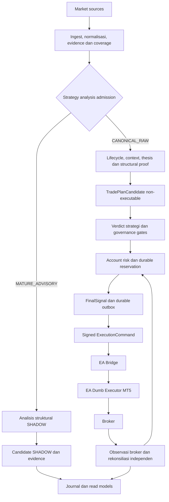

<a id="top"></a>

<div align="center">

<picture>
  <source media="(prefers-color-scheme: dark)" srcset="docs/assets/readme/wolf15-dark.svg">
  <source media="(prefers-color-scheme: light)" srcset="docs/assets/readme/wolf15-light.svg">
  
</picture>

# TUYUL-FX · WOLF15

**Governed Trading Infrastructure**

Strategy 5S-CR · SSOT v3.1 · Modular monorepo · Railway × MetaTrader 5

**WOLF15 memutuskan. Risk mengotorisasi. EA mengeksekusi. Broker mengonfirmasi.**

[Tentang](#tentang-wolf15) · [Arsitektur](#arsitektur-dan-alur-sistem) · [Strategi](#strategi-5s-cr-dan-ssot) · [Risiko](#risiko-dan-execution-campaign) · [EA MT5](#ea-dumb-executor-dan-rekonsiliasi) · [Layanan](#komponen-dan-layanan) · [Pengembangan](#pengembangan-dan-pengujian) · [Dokumentasi](#dokumentasi-lanjutan)

</div>

---

## Tentang WOLF15

WOLF15 adalah proyek infrastruktur trading yang dirancang untuk mengolah evidence pasar menjadi keputusan Strategy 5S-CR yang dapat ditelusuri, menilai kelayakan modal melalui domain risiko yang terpisah, dan meneruskan perintah yang sah kepada EA MetaTrader 5 sebagai **dumb executor**.

Repository ini menyatukan ingest data, context, analisis strategi, constitution, governance, capital risk, execution bridge, persistence, observability, dan riset dalam satu monorepo. Pemisahan layanan menjaga agar pengumpulan data, pengambilan keputusan, otorisasi modal, pengiriman command, dan pembuktian hasil broker mempunyai tanggung jawab yang jelas.

Tujuan desainnya adalah **ketepatan keputusan, kendali risiko, integritas eksekusi, dan kemampuan merekonstruksi setiap transisi dari input sampai outcome**. EA tidak mencari sinyal atau menjalankan strategi lokal; analisis dan keputusan trading tetap berada pada sistem WOLF15.

> [!NOTE]
> README ini merangkum rancangan, kontrak, dan struktur sistem. Cakupan implementasi serta penggunaan suatu rilis mengikuti source, konfigurasi, dan bukti pengujiannya. Ringkasan arsitektur bukan pernyataan bahwa seluruh kemampuan telah aktif atau menjadi izin eksekusi.

## Prinsip Desain

| Prinsip | Penerapan dalam rancangan |
| --- | --- |
| **Pemisahan kewenangan** | Evidence, verdict strategi, persetujuan modal, delivery, dan rekonsiliasi broker memiliki owner berbeda. |
| **Evidence sebelum otorisasi** | Data, waktu, policy, identitas akun, dan lineage harus memenuhi kontrak sebelum keputusan diteruskan. |
| **Keputusan yang dapat direproduksi** | Input, as-of time, source, dan policy yang sama menjadi dasar replay atas identity, reason, serta output. |
| **State finansial durable** | Reservation, campaign, leg, command, dan disposition disimpan melalui boundary transaksi yang jelas. |
| **Fail-closed pada boundary terkait** | Kekurangan evidence atau kegagalan prasyarat menahan kewenangan yang terdampak; unknown tidak diubah menjadi kondisi sehat. |
| **Recovery melalui rekonsiliasi** | Restart, timeout, dan hasil submit yang ambigu diselesaikan melalui ledger serta bukti broker, bukan pengiriman ulang secara buta. |

## Arsitektur dan Alur Sistem

WOLF15 memisahkan **layer**, **domain**, dan **service**. Layer menjelaskan model analisis serta kewenangan, domain menjelaskan tanggung jawab, sedangkan service merupakan batas proses atau deployment. Model 15-layer tidak sama dengan jumlah layanan Railway.

Alur berikut menggambarkan hubungan data dan otorisasi menurut kontrak sistem, bukan urutan thread atau inventaris deployment:



Orchestrator mengoordinasikan lifecycle, mode, session, dan ownership pekerjaan. API menyediakan antarmuka ingress, query, autentikasi, serta kontrol sesuai kontrak; API tidak menjadi owner kedua bagi autonomous orchestrator. Command producer dan bridge meneruskan keputusan yang sah tanpa memperluas kewenangan sumbernya.

Rincian tersedia pada [indeks arsitektur](docs/architecture/README.md), [authority boundaries](docs/architecture/authority-boundaries.md), dan [runtime ownership map](docs/services/runtime-ownership-map.json).

## Strategi 5S-CR dan SSOT

**Rujukan semantik strategi adalah [SSOT v3.1 terpilih](docs/remediation/2026-09-09/source-binding/selected-ssot-v3.1.md).** README tidak mengganti dokumen tersebut, memilih ulang versi strategi, atau menetapkan policy trading baru.

Strategy 5S-CR memisahkan pemilihan pair, pengelolaan episode analisis, penyelesaian context, pembuktian arah, dan perhitungan trade geometry. Pressure merupakan evidence dan dasar hipotesis awal, bukan perintah BUY atau SELL yang langsung dapat dieksekusi.

### Tahapan utama

| Tahap | Fungsi | Keluaran dan batas kewenangan |
| --- | --- | --- |
| **S1A — PairAdmission** | Mengevaluasi canonical raw activity, continuity, coverage, dan provenance. | Admission raw beserta reason dan lineage; bukan izin order. |
| **S1B — StrategyAnalysisAdmission** | Memisahkan analisis dari canonical raw dan mature advisory yang memenuhi syarat. | Kelas admission dan kelayakan promosi yang eksplisit. |
| **S2 — AnalysisLifecycle** | Menjaga satu episode analisis, evidence history, material trigger, dan current eligibility. | Lifecycle durable dengan identity yang stabil. |
| **S3 — ContextEpoch** | Menentukan context material, legal direction domain, route, dan target map. | Context serta batas arah yang boleh diuji. |
| **S4 — DirectionalThesis** | Membentuk thesis immutable dari struktur H1 yang closed dan ordered M15 proof. | Thesis dengan bukti struktur; belum menjadi instruksi broker. |
| **S5 — Trade geometry** | Menguji target, structural SL, interval entry, biaya, dan batas broker. | `TradePlanCandidate` non-executable dengan lineage lengkap. |

### Dual analysis admission

`CANONICAL_RAW` dan `MATURE_ADVISORY` tidak memiliki kewenangan yang sama. Mature advisory yang memenuhi predicate admission membuka atau terhubung ke lifecycle dan menjalani analisis struktural dalam mode SHADOW. Candidate yang terbentuk tetap **SHADOW-only**; jalur ini tidak boleh membuat risk reservation, FinalSignal executable, atau ExecutionCommand.

Apabila raw grant yang sah kemudian tersedia, episode yang sama harus melalui evaluasi ulang canonical. Candidate advisory tidak otomatis dipromosikan hanya karena status admission berubah.

### Context, struktur, dan waktu

D1/H4 menyediakan context serta sumber target struktural. H1 memberi pembuktian struktur arah; M15 menyediakan urutan break, acceptance, failed reclaim, atau retest sesuai route. M1 dan quote digunakan untuk pressure range, execution box, serta evaluasi harga sesuai kontrak evidence.

Evidence harus sudah tersedia pada waktu keputusan. Candle forming, coverage yang belum lengkap, atau revision yang baru diterima kemudian tidak boleh dipakai untuk membenarkan keputusan lampau. Event time, available-at time, decision time, dan expiry mempunyai fungsi berbeda.

Duplicate telemetry bukan observation, pulse, lifecycle, atau context epoch baru. Microboost tetap menjadi pressure/timing evidence, bukan otorisasi arah atau order secara mandiri.

### Target-first trade geometry

Solver mengikuti urutan SSOT v3.1: thesis dan ordered proof yang sah, target struktural terdekat yang legal serta masih fresh, route-specific entry interval, structural invalidation/SL, lalu pemeriksaan target room, RR, biaya, dan batas broker.

```text
Valid thesis dan ordered proof
→ Nearest legal structural target
→ Route-specific entry interval
→ Structural invalidation / SL
→ Target-room, RR, cost dan broker constraints
→ Feasible-entry intersection
→ TradePlanCandidate dengan evidence lineage
```

TP1 berasal dari struktur pasar, bukan sekadar perkalian jarak SL. Target valid yang lebih dekat tidak boleh dilewati demi memaksa RR. Jika tidak ada irisan entry yang layak, hasilnya tetap tidak dapat dieksekusi.

Threshold RR, target floor, definisi pip/point/tick, dan biaya mengikuti SSOT serta policy/spec yang terikat. README tidak menetapkan angka risiko aktif atau menyamakan aturan semua instrumen. `WAIT` dan `NO_TRADE` merupakan outcome analisis, bukan transaksi menang.

## Risiko dan Execution Campaign

Account-risk domain menerima candidate dan verdict strategi yang sah, kemudian memeriksa identitas akun/server/mode, freshness snapshot, spesifikasi broker, policy, exposure, dan hasil rekonsiliasi. **Final size dan risk reservation merupakan kewenangan domain risiko, bukan strategi, antarmuka operator, atau EA.**

### Reservation dan exposure

Pemeriksaan kapasitas serta pembentukan reservation harus atomik pada scope akun. Exposure yang relevan mencakup risiko posisi terisi, pending order yang belum terisi, reservation yang belum disubmit, dan submission yang hasilnya masih unknown, tanpa menghitung bagian yang sama dua kali.

Volume mengikuti broker step dan batas policy. Jika ukuran yang memenuhi budget berada di bawah minimum broker, sistem menolak candidate tersebut, bukan menaikkan risiko agar order dapat masuk. Publication, timeout, atau delivery expiry tidak otomatis menjadi alasan melepaskan reservation.

### Parent, child, dan compounding

Analysis lifecycle berbeda dari execution campaign. Lifecycle mengelola episode sebelum exposure; campaign mengikat keputusan yang diotorisasi dengan parent/child leg, risk reservation, dan outcome eksekusinya.

Parent memerlukan canonical evidence, structural proof, serta persetujuan modal. Child memerlukan parent dan campaign yang sesuai, setup material, trigger independen, target room, geometry, serta budget risiko yang sah. Pressure berulang saja tidak otomatis menghasilkan add-on.

Evidence baru sebelum parent fill ditangani sebagai revision atau supersession sesuai kontrak. Slot child, budget campaign, dan compounding mengikuti profile berversi. Basis saldo/reconciliation tidak diubah diam-diam di tengah campaign; floating profit tidak otomatis menjadi released risk.

Rincian: [risk stack](docs/architecture/risk-stack.md), [risk](risk/), [allocation](allocation/), dan [execution](execution/).

## EA Dumb Executor dan Rekonsiliasi

EA MT5 merupakan **adapter eksekusi mekanis dengan validasi**, bukan strategy engine. Input eksekusinya adalah signed `ExecutionCommand` yang berasal dari handoff strategi dan risk yang sah, bukan pressure telemetry atau candidate mentah.

Komunikasi mengikuti kontrak HTTPS pull melalui EA Bridge:

```text
EA → register / heartbeat / account snapshot
EA → poll command → claim
EA → validasi mekanis dan broker preflight
EA → jalankan command yang sah
EA → execution report
Backend + broker reader → rekonsiliasi
```

| Tanggung jawab EA dan bridge | Batas yang dipertahankan |
| --- | --- |
| Mengikat command ke executor, akun, server, dan session. | Command tidak dialihkan ke penerima lain. |
| Memvalidasi signature, version, payload, waktu, dan action yang diizinkan. | Input tidak sah atau expired ditolak. |
| Memeriksa representability volume, harga, dan batas broker. | EA tidak mengubah arah, lot, SL, atau TP untuk meloloskan command. |
| Menjaga marker submit dan idempotency yang persistent. | Retry delivery tidak menjadi logical submission baru. |
| Melaporkan hasil dan membantu recovery. | ACK atau heartbeat tidak menggantikan bukti order, deal, dan position. |

Otorisasi dan delivery dipisahkan. Boundary otorisasi menyimpan reservation, campaign/leg, final decision, dan publication intent secara konsisten. Delivery membentuk command dari authority yang masih sah serta menangani pengiriman secara idempotent.

Jika hasil submission ambigu, sistem mempertahankan state risiko dan merekonsiliasi broker sebelum retry. Partial fill, pending residual, cancel, expiry, serta report yang datang tidak berurutan harus ditautkan ke intent dan command yang sama.

Native MT5 reader/MCP berada pada jalur observasi dan audit yang terpisah. Jalur tersebut membaca account, orders, deals, positions, dan history untuk dibandingkan dengan ledger; ia bukan pengganti command plane EA.

Rincian: [protocol MT5](contracts/mt5_execution_protocol.py), [panduan EA Bridge](docs/services/wolf15-ea-bridge/README.md), [source executor](ea_interface/), dan [runbook MT5](docs/runbooks/).

## Komponen dan Layanan

Katalog ini menjelaskan pembagian tanggung jawab dalam sistem. Entry point, dependency, konfigurasi, dan lifecycle masing-masing layanan dirinci pada [indeks layanan](docs/services/README.md).

| Komponen | Tanggung jawab | Source / panduan |
| --- | --- | --- |
| **Ingest** | Mengelola feed provider, normalisasi data pasar, publication context, dan freshness. | [services/ingest](services/ingest/) · [panduan ingest](docs/services/wolf15-ingest/README.md) |
| **Engine** | Memproses context dan evidence untuk analisis, pressure, serta keluaran pipeline strategi. | [services/engine](services/engine/) · [panduan engine](docs/services/wolf15-engine/README.md) |
| **Pressure outbox / analysis workers** | Mengirim pressure records secara durable dan mengoordinasikan pekerjaan evidence serta outcome. | [services/pressure_outbox](services/pressure_outbox/) · [panduan](docs/services/wolf15-pressure-outbox/README.md) |
| **Constitution** | Mengevaluasi constitutional strategy verdict sesuai evidence dan versi kontrak; tidak menggantikan capital approval. | [constitution](constitution/) · [contracts](contracts/) |
| **Orchestrator** | Mengoordinasikan lifecycle, mode, session, dan ownership pekerjaan. | [services/orchestrator](services/orchestrator/) · [panduan](docs/services/wolf15-orchestrator/README.md) |
| **Trade / execution** | Mengelola allocation dan pekerjaan eksekusi yang dibatasi account-risk serta execution contracts. | [services/trade](services/trade/) · [panduan execution](docs/services/wolf15-execution/README.md) |
| **API** | Menyediakan autentikasi, query, projection delivery, dan kontrol sesuai role/scope. | [api](api/) · [panduan API](docs/services/wolf15-api/README.md) |
| **EA Bridge** | Menangani transport command, autentikasi executor, claim/lease, heartbeat, dan report. | [services/ea_bridge](services/ea_bridge/) · [panduan bridge](docs/services/wolf15-ea-bridge/README.md) |
| **MT5 executor dan reader** | Memisahkan eksekusi mekanis dari observasi broker untuk rekonsiliasi. | [ea_interface](ea_interface/) · [ops/mt5_mcp](ops/mt5_mcp/) |
| **Research workers** | Menjalankan pekerjaan backtest, Monte Carlo, dan regime tanpa menjadi otoritas order. | [services/worker](services/worker/) |
| **Migrator** | Menjalankan perubahan schema sebagai pekerjaan tersendiri. | [migration source](storage/migrations/versions/) · [launcher](deploy/railway/start_migrator.sh) |

PostgreSQL menjadi fondasi penyimpanan journal, audit, ledger, dan recovery state. Redis digunakan untuk shared runtime state, cache, transport, heartbeat, dan ownership fencing sesuai kontrak komponen. Penyimpanan dan transport tidak menggantikan pemilik keputusan pada domain strategi atau risiko.

## Data dan Observability

| Data | Sumber kewenangan menurut kontrak | Peran cache atau projection |
| --- | --- | --- |
| Observation, coverage, dan revision | Evidence producer/ledger dengan provenance. | Mempercepat pembacaan, bukan mengisi missing evidence secara implisit. |
| Lifecycle, context, thesis, box, dan candidate | State strategi dengan revision serta current eligibility. | Menampilkan state, bukan menciptakan identity atau memperpanjang expiry. |
| Exposure, reservation, campaign, dan leg | Durable account-risk state. | Menyajikan ringkasan, bukan menambah risk headroom. |
| Command dan disposition | Bound backend ledger/outbox. | Menampilkan delivery state, bukan memberikan approval baru. |
| Order, deal, position, dan outcome | Evidence broker yang direkonsiliasi. | Menampilkan hasil, bukan mengganti broker truth. |

Observability membedakan liveness proses, readiness dependency, freshness data, kemajuan pekerjaan, integritas risiko, dan integritas eksekusi. HTTP `200` atau heartbeat aktif tidak dengan sendirinya membuktikan seluruh alur sehat.

Antarmuka operator menyajikan projection serta reason code sesuai akses yang diberikan. Data unavailable, stale, unknown, dan hasil kosong yang sah harus tetap dapat dibedakan. Riset dan enrichment memberikan insight; keduanya tidak mempromosikan proposal menjadi order.

## Struktur Repository

| Path | Peran |
| --- | --- |
| [ingest/](ingest/), [context/](context/) | Market ingress, candle/context, dan source state. |
| [analysis/](analysis/), [constitution/](constitution/) | Analisis strategi dan constitutional boundaries. |
| [risk/](risk/), [allocation/](allocation/), [execution/](execution/) | Capital risk, allocation, dan execution domains. |
| [contracts/](contracts/) | Schema serta kontrak lintas domain. |
| [services/](services/), [api/](api/) | Service entrypoints, runners, dan antarmuka HTTP. |
| [ea_interface/](ea_interface/), [ops/mt5_mcp/](ops/mt5_mcp/) | Executor MQL5 serta tooling observasi MT5. |
| [storage/](storage/), [storage/migrations/versions/](storage/migrations/versions/) | Persistence dan migration history. |
| [deploy/railway/](deploy/railway/) | Launchers dan dukungan deployment layanan. |
| [.github/workflows/](.github/workflows/) | CI, quality checks, keamanan, dan workflow rilis. |
| [tests/](tests/) | Unit, contract, fixture, replay, dan integration tests. |
| [docs/](docs/) | Arsitektur, strategi, layanan, runbook, dan arsip audit. |

Manifest `railway*.toml` di repository menentukan konfigurasi deployment per role. Rincian file dan dependency mengikuti revision source yang digunakan.

## Pengembangan dan Pengujian

Mulai dari kontrak domain dan [panduan layanan](docs/services/README.md) yang akan dikerjakan. Gunakan dependency serta konfigurasi dari manifest komponen dan workflow pada revision yang sama, bukan instalasi global atau asumsi dari service lain.

### Orientasi source

Perintah berikut membaca checkout dan manifest tanpa mengaktifkan layanan:

```bash
git rev-parse HEAD
git status --short
git show HEAD:requirements.txt
git show HEAD:pyproject.toml
```

Pertahankan perubahan lokal yang sudah ada dan gunakan branch/worktree sesuai scope pekerjaan. Kebutuhan konfigurasi mengikuti `.env.example` serta manifest layanan. Pekerjaan native MT5 dan storage integration menggunakan environment yang sesuai dengan kontraknya, terpisah dari asumsi unit test biasa.

### Environment Python lokal

Dari root repository, gunakan Python 3.11 sesuai workflow CI untuk membuat
virtualenv core terpisah:

```bash
python -m venv .venv-api
```

Aktifkan dengan `source .venv-api/bin/activate` pada Linux/macOS atau
`.\.venv-api\Scripts\Activate.ps1` pada Windows PowerShell. Setelah aktif,
pasang dependency core menggunakan `python -m pip install -r requirements.txt`.
Jalankan tes sebagai `python -m pytest` dari root repository sesuai scope
fixture yang dipilih. Native MT5 MCP menggunakan environment terpisah dan
manifest `ops/mt5_mcp/requirements.txt`.

### Lapisan pengujian

| Jenis pengujian | Fokus |
| --- | --- |
| **Static checks** | Lint, format, typing, schema, dan compatibility. |
| **Unit dan contract** | Perilaku komponen, positive/negative cases, dan batas kewenangan. |
| **Storage integration** | Atomicity, concurrency, migration, persistence, serta recovery. |
| **Strategy replay** | Admission, lifecycle, ordered proof, geometry, determinisme, dan pencegahan future leakage. |
| **EA dan terminal** | Compile, validasi protocol, idempotency, report, serta restart behavior. |
| **Broker reconciliation** | Kesesuaian intent dan command dengan order, deal, position, serta outcome. |

Focused tests membantu diagnosis, tetapi tidak menggantikan required checks. PostgreSQL/Redis integration menggunakan instance disposable yang ditetapkan untuk pengujian, bukan ledger produksi. Hasil lokal, CI, terminal, dan broker harus tetap dibedakan berdasarkan source serta cakupannya.

Perintah pengujian dan quality gates mengikuti [panduan CI](docs/ci-workflow-guide.md) serta [workflow repository](.github/workflows/). README tidak menyimpan angka hasil tes dari satu checkpoint sebagai ukuran kualitas permanen.

## Deployment dan Keamanan

Deployment mengikuti manifest `railway*.toml`, launchers dalam [deploy/railway](deploy/railway/), dan [kebijakan rilis](docs/runbooks/owner-operated-release-policy.md). Setiap rilis mengikat source, schema/migration, konfigurasi efektif, policy, artifact, dan target layanan yang sesuai.

Perubahan source, deployment, mode executor, dan izin efek broker merupakan tindakan berbeda. Keberhasilan satu tahap tidak memberikan persetujuan otomatis untuk tahap berikutnya. Detail topologi tersedia pada [arsitektur deployment Railway](docs/architecture/deployment-railway.md); prosedur operasional berada di [runbooks](docs/runbooks/).

Credential, token, signing material, DSN berpassword, dan payload akun privat tidak disimpan dalam README, source publik, atau bukti pengujian yang dipublikasikan. Autentikasi, role/scope, validasi input, signature, expiry, dan audit diterapkan pada boundary masing-masing.

Recovery mempertahankan ledger, proteksi, dan evidence. Mengembalikan source tidak membatalkan order broker; tindakan atas exposure memerlukan rekonsiliasi dan prosedur yang sesuai. Temuan keamanan sensitif dilaporkan melalui kanal privat maintainer yang telah disepakati.

## Dokumentasi Lanjutan

| Kebutuhan | Rujukan |
| --- | --- |
| Memahami arsitektur dan pembagian kewenangan | [Arsitektur](docs/architecture/README.md) · [Authority boundaries](docs/architecture/authority-boundaries.md) |
| Memahami Strategy 5S-CR | [SSOT v3.1 terpilih](docs/remediation/2026-09-09/source-binding/selected-ssot-v3.1.md) · [Kontrak](contracts/) |
| Memahami risiko dan eksekusi | [Risk stack](docs/architecture/risk-stack.md) · [Protocol MT5](contracts/mt5_execution_protocol.py) |
| Mengembangkan komponen | [Indeks layanan](docs/services/README.md) · [Pengujian](tests/) · [Panduan CI](docs/ci-workflow-guide.md) |
| Mengoperasikan dan merilis sistem | [Runbooks](docs/runbooks/) · [Release policy](docs/runbooks/owner-operated-release-policy.md) |
| Membaca pengetahuan dan sejarah desain | [Knowledge](docs/knowledge/README.md) · [Concepts](docs/concepts/README.md) · [Legacy archive](docs/legacy/README.md) |
| Menelusuri laporan historis | [Paket audit dan remediasi](docs/remediation/2026-09-09/README.md) |

Laporan progres, hasil pengujian, PR/commit, dan observasi deployment ditempatkan pada dokumen audit atau rilis dengan tanggal serta scope masing-masing. Arsip historis bukan indikator kondisi runtime saat ini.

## Kontribusi dan Lisensi

Kontribusi menyertakan tujuan, scope, kontrak yang terdampak, perubahan yang dapat ditinjau, serta pengujian yang relevan. Pisahkan perubahan format dari perubahan perilaku ketika hal itu membantu review. Untuk pekerjaan berbantuan agen, ikuti [AGENTS.md](AGENTS.md).

Perbarui README ketika berubah tujuan sistem, arsitektur, tanggung jawab komponen, antarmuka, cara penggunaan, atau navigasi dokumentasi. Perkembangan harian, blocker environment, hasil tes, dan status deployment tetap berada pada laporan masing-masing.

Pemilik repository: **tjx578 / KELANA TJX**. Ketentuan penggunaan mengikuti [LICENSE](LICENSE) pada repository.

---

<div align="center">

**Evidence defines the decision. Risk defines the exposure. Execution preserves the contract.**

[Kembali ke atas](#top)

</div>
