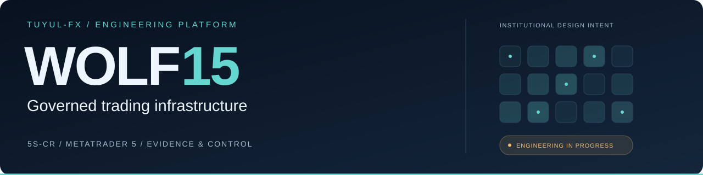
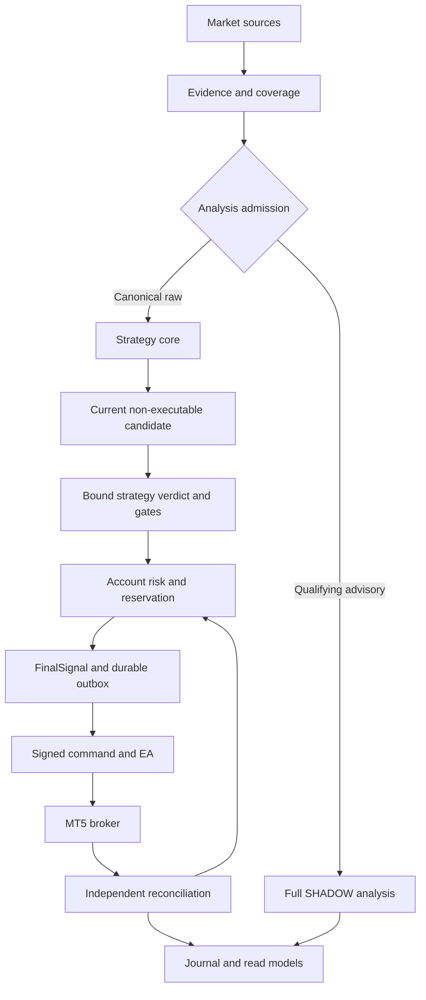
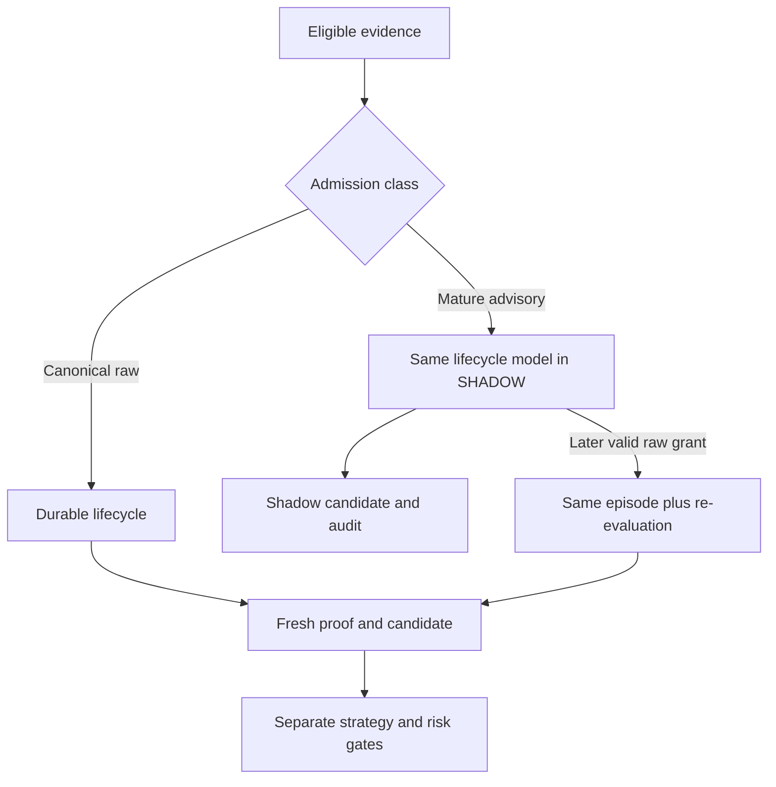

<a name="top"></a>

<div align="center">

<picture>
  <source media="(prefers-color-scheme: dark)" srcset="docs/assets/readme/wolf15-dark.svg">
  <source media="(prefers-color-scheme: light)" srcset="docs/assets/readme/wolf15-light.svg">
  
</picture>

# TUYUL-FX · WOLF15

**Governed Trading Infrastructure**

Strategy 5S-CR · Modular monorepo · MetaTrader 5 · Institutional design intent

**`ENGINEERING: INCOMPLETE / HOLD`** &nbsp; **`SSOT: v3.1 REPOSITORY`** &nbsp; **`AUTOMATED DEMO: NOT PROVEN`**

[Status](#status-dan-bukti) · [Arsitektur](#arsitektur-sistem) · [Strategi](#strategi-5s-cr) · [Layanan](#peta-layanan) · [Developer](#mulai-untuk-developer) · [Roadmap](#roadmap-dan-definition-of-done) · [Dokumentasi](#indeks-dokumentasi)

</div>

---

WOLF15 dirancang untuk mengubah evidence pasar menjadi keputusan strategi yang dapat ditelusuri, menilai kelayakan modal secara terpisah, lalu mengirim perintah terikat ke EA MetaTrader 5 yang menjalankan fungsi eksekusi mekanis. Fokusnya adalah **ketepatan keputusan, kendali risiko, integritas eksekusi, dan kemampuan membuktikan setiap transisi**.

Repositori menggabungkan ingest, context, analysis, governance, risk, execution bridge, dashboard dan pekerjaan riset. Desain berorientasi institusional diterjemahkan menjadi pemisahan kewenangan, state durable, policy berversi, pengujian kegagalan dan rekonsiliasi broker. Kesiapan setiap kemampuan ditentukan oleh bukti acceptance pada artifact yang tepat.

> [!IMPORTANT]
> **Snapshot dokumentasi: 9 September 2026 WITA.** Checkpoint terbaru yang dilaporkan adalah [Draft PR #423](https://github.com/tjx578/TUYUL-FX-WOLF-15LAYER-SYSTEM/pull/423), HEAD `261a3b476055accc3d0ea45ebc80a910e0e80f6b`. Status program **INCOMPLETE / HOLD**, dengan **0/6 milestone engineering selesai**. Pengujian lokal parsial tersedia; natural DEMO, parent-child, compounding dan kesiapan REAL belum terbukti. Informasi snapshot ini bukan indikator kesehatan runtime secara langsung.

## Navigasi menurut peran

| Pembaca | Mulai dari | Pertanyaan yang dijawab |
|---|---|---|
| Owner / reviewer | [Status dan bukti](#status-dan-bukti), [roadmap](#roadmap-dan-definition-of-done) | Apa yang sudah dikerjakan, apa yang belum selesai, dan apa bukti penutupnya? |
| Engineer strategi | [5S-CR](#strategi-5s-cr), [SSOT](#sumber-kebenaran-dan-kontrak) | Bagaimana admission, lifecycle, proof dan candidate dibentuk? |
| Engineer risk / execution | [Risiko](#capital-risk-dan-campaign), [EA dan broker](#execution-bridge-dan-ea-mt5) | Siapa mengotorisasi modal, mengirim order, dan membuktikan outcome? |
| Platform / operations | [Layanan](#peta-layanan), [operasi](#operasi-observability-dan-recovery) | Apa owner proses, sumber readiness, dan batas recovery? |
| Contributor | [Developer](#mulai-untuk-developer), [pengujian](#pengujian-dan-quality-gates) | Bagaimana bekerja pada source yang tepat dan memberikan evidence yang dapat ditinjau? |

## Status dan bukti

### Cara membaca klaim

| Label | Arti |
|---|---|
| **Source snapshot** | Didukung source atau inventory historis yang diperiksa; tidak otomatis sama dengan deployment aktif |
| **Dilaporkan** | Berasal dari laporan pekerjaan terbaru; receipt/remote belum diperiksa ulang saat README ini disusun |
| **Kontrak target** | Perilaku yang wajib dicapai menurut strategi, risk, execution atau keputusan desain |
| **Belum terbukti** | Evidence wajib belum tersedia, belum dijalankan atau belum cukup untuk menutup acceptance |

Baseline source audit berada pada `1837f4b7cbded620c35933af980e9abd166de39e`. Laporan terbaru menyebut main `773150952311db3dbf5188f36536b7837d8ec296` dan branch `codex/master-remediation-20260909` pada HEAD PR #423 di atas. Akses source terbaru tidak berhasil diperoleh dalam sesi penyusunan README; klaim baru tetap diberi provenance **dilaporkan**. Periksa [register aktual](docs/remediation/2026-09-09/CURRENT_DONE_Register_41_Actions.csv) pada revision yang digunakan sebelum mengoperasikan rilis.

### Kemajuan yang dilaporkan

| Area | Perubahan parsial | Batas acceptance |
|---|---|---|
| C01 — release | Pengikatan source SHA dan CI receipt; mismatch, missing/skipped/failed steps ditolak | Successful exact-source CI, seluruh jalur release dan deployed parity belum lengkap |
| C02 — ownership | API-only; embedded orchestrator ditolak sebelum consumer berjalan | Dedicated owner, fencing dan konfigurasi runtime aktual belum terbukti |
| C03 — quality gates | Dashboard lint/test dan pemeriksaan kontrak/migration failure lebih tegas | Seluruh required checks dan disposable database suite belum lengkap |
| C06 — readiness | Boot router gagal/belum lengkap menghasilkan `503` | Mandatory-task supervision, fatal exit dan production fault proof belum lengkap |
| P2/P3 — natural flow | Komponen strategi, risk, protocol dan projection tersedia dalam source | Admission, target universe, identity handoff dan natural risk/command/EA belum konvergen |
| P4/P5 — MT5 | Jalur SHADOW/canary dan kontrak mekanis menjadi fondasi | Binding DEMO, exact combined EA, natural parent-child serta broker outcome belum lengkap |

Hanya **A00** dilaporkan selesai dalam scope akuisisi sumber. Empat puluh aksi lainnya belum ditutup; sebagian telah memiliki patch dan pengujian parsial.

<details>
<summary><strong>Checkpoint commit dan hasil pengujian lokal</strong></summary>

| Commit | Isi yang dilaporkan |
|---|---|
| `08e902b3` | Source/CI binding, API-only dan readiness router |
| `c7d51c35` | Format 11 file baseline; AST tetap identik |
| `ac19a69a` | Fixture MCP menjadi job CI terpisah yang tetap wajib |
| `261a3b47` | Arsip input, audit dan rekonsiliasi status 41 aksi |

| Rangkaian | Hasil yang dilaporkan | Batas bukti |
|---|---:|---|
| Tes pada commit fungsional | 484 lulus | Bukan full closure environment API yang dipatok |
| Regresi sesudah format | 88 lulus | Run berbeda; cakupan dapat bertumpang tindih |
| Fixture MCP terisolasi | 7 lulus | FakeMT5; tidak membuktikan native terminal/broker |
| CI/source gate sesudah perubahan terakhir | 55 lulus | Pengujian lokal gate, bukan successful remote CI |
| Kesetaraan AST | 11/11 | Membuktikan kesetaraan AST file yang diformat |
| Ruff lint dan format | Lulus | Tidak membuktikan strategy/risk/runtime acceptance |

Jumlah di atas **tidak dijumlahkan sebagai kasus unik**. Laporan pascapublikasi menyebut 36 job pada 9 workflow gagal dengan `runner_id=0` dan langkah kosong; hal itu belum membuktikan tes source berjalan atau penyebab billing tertentu. Rujukan: [validation.json](docs/remediation/2026-09-09/validation.json).

</details>

## Tujuan dan prinsip desain

WOLF15 ditujukan untuk pengembangan dan pengoperasian trading terkontrol, dari analisis dan SHADOW sampai DEMO otomatis yang terikat bukti. Kelulusan REAL membutuhkan evaluasi tersendiri.

| Prinsip | Konsekuensi teknis |
|---|---|
| **Segregation of duties** | Evidence, strategy verdict, capital approval, delivery dan broker reconciliation mempunyai owner berbeda |
| **Evidence before authority** | Data, policy, account, artifact dan lineage harus sah sebelum transisi berisiko |
| **Deterministic decisions** | Input, as-of clock, policy dan source yang sama harus menghasilkan identity, reason dan keputusan yang dapat direproduksi |
| **Durable financial state** | Reservation, campaign/leg, command dan disposition disimpan melalui kontrak transaksi yang jelas |
| **Failure containment** | Kegagalan dependency wajib menahan authority yang terdampak dan tetap terlihat oleh operator |
| **Recoverable operations** | Restart dan timeout ditangani melalui state serta rekonsiliasi; unknown tidak dihapus untuk membuat status terlihat sehat |
| **Versioned releases** | Bukti CI dan acceptance terikat source, schema, konfigurasi serta binary yang digunakan |
| **Measurable quality** | Latency, queue age, freshness, resource dan recovery dinilai terhadap SLO yang ditetapkan sebelum evaluasi |

Istilah **institusional** pada README menjelaskan sasaran desain tersebut. Sertifikasi institusional, kepatuhan regulasi/prop-firm, high availability, kapasitas transaksi dan profitabilitas memerlukan bukti serta scope tersendiri.

## Sumber kebenaran dan kontrak

**Strategi tetap mengikuti SSOT v3.1 yang dipilih di repository.** README adalah pintu masuk dokumentasi; ia tidak mengganti kontrak domain atau memilih ulang policy trading.

| Domain | Rujukan utama | Aturan pemakaian |
|---|---|---|
| Strategy 5S-CR | [SSOT v3.1 Candidate](docs/remediation/2026-09-09/source-binding/selected-ssot-v3.1.md) | Bind exact path, commit, digest dan rule version pada S01 |
| Status program | [Remediation README](docs/remediation/2026-09-09/README.md), [41-action register](docs/remediation/2026-09-09/CURRENT_DONE_Register_41_Actions.csv) | Rencana, patch, pengujian dan kelulusan dipisahkan |
| Dependency pekerjaan | [CURRENT_GOAP_Status.json](docs/remediation/2026-09-09/CURRENT_GOAP_Status.json) | Hard dependencies tetap berlaku |
| Protocol | [contracts/mt5_execution_protocol.py](contracts/mt5_execution_protocol.py) | Command class, signature, binding, timing dan idempotency mengikuti versi terpilih |
| Capital risk | Risk contract dan policy profile yang dibind R01/R02 | Account/mode/currency dan batas risiko harus eksplisit |
| Deployment | TOML/launcher, release manifest dan evidence artifact aktual | Nama service atau status SUCCESS tidak membuktikan effective config |
| Broker outcome | Evidence broker yang direkonsiliasi | ACK dan heartbeat executor tidak menjadi bukti independen |

Full SSOT terpilih dilaporkan ditemukan pada docs commit `dd27ae87d0207466caad4c3e098224112ac0eaf7`, dengan SHA-256 `6daea387745ffa305d3cd55b0fee4f0efed79be21e24503c2a1f8a16c6a83902`. Parity terhadap salinan historis assessment belum lengkap. Ringkasan strategi di bawah mengikuti intent v3.1 yang tersedia; exact repository bytes dan resolusi kontrak tetap menentukan implementasi. R1/R2 tidak diadopsi oleh README ini.

Nama folder, label “approved”, atau nama kelas tidak sendirinya menetapkan authority. Perselisihan antarversi diselesaikan melalui source binding dan keputusan kontrak yang tercatat.

## Arsitektur sistem

### Domain dan ownership

| Domain | Tanggung jawab | Batas authority |
|---|---|---|
| Market/evidence | Ingest, normalisasi, provenance, coverage, candle dan revision | Memproduksi evidence; tidak membuat order |
| Analysis L1–L11 | Context, struktur, arah legal, validasi dan candidate | Analisis/validasi; tidak menentukan final capital size |
| Constitution L12 | Constitutional strategy verdict yang terikat evidence dan versi | Verdict strategi; tidak menggantikan account-risk approval |
| Account risk | Snapshot akun, exposure, final sizing, campaign/leg dan reservation | Kelayakan modal sesuai policy terikat |
| Orchestrator | Koordinasi lifecycle, mode, session, locks dan pekerjaan | Mengatur alur; tidak menciptakan strategi baru |
| Command producer / bridge | Membentuk dan mengirim command dari handoff yang sah | Tidak meningkatkan authority sumber |
| EA MT5 | Validasi mekanis, submit/report, proteksi dan recovery sesuai kontrak | Dapat menolak input tidak sah; tidak merancang ulang arah/lot/SL/TP |
| Broker reader | Mengumpulkan evidence orders/deals/positions/history | Membuktikan outcome; terpisah dari klaim executor |
| Journal / dashboard / research | Pencatatan, projection, observasi dan enrichment | Tidak mempromosikan strategy atau capital authority |

**15-layer merupakan model desain; jumlah layer tidak sama dengan jumlah service Railway.** Mapping L12, mandatory downstream gates, V11 dan peran layer lainnya perlu source/version serta trace yang jelas. Diagram ini tidak mengklaim setiap edge sudah terimplementasi atau seluruh layer sudah wired.

### Target flow keputusan dan feedback

View berikut menunjukkan dependency data dan authority. Scheduler dapat menjalankan pekerjaan independen secara paralel sesuai kontrak; gambar ini bukan deklarasi urutan thread runtime.



Natural path pada bagian candidate → risk → command → EA masih merupakan area integrasi terbuka. Projection SHADOW dan engineering canary tidak menjadi pengganti jalur natural tersebut.

### Data authority

| Data | Sumber authoritative menurut kontrak target | Peran cache/projection |
|---|---|---|
| Observation, coverage dan revision | Evidence producer/ledger dengan provenance | Mempercepat akses; tidak mengisi missing range secara implisit |
| Lifecycle, thesis, box dan candidate | Repository strategi dengan current revision/eligibility | Telemetry tidak mengubah identity atau memperpanjang expiry |
| Exposure dan campaign/leg | Durable risk ledger dan transaksi account-scoped | Redis atau dashboard tidak menambah risk headroom |
| Command dan disposition | Backend ledger/outbox yang terikat | Delivery retry tidak menghasilkan approval baru |
| Order/deal/position/outcome | Broker evidence yang direkonsiliasi | ACK dan status UI bukan pengganti broker truth |

PostgreSQL menyediakan fondasi persistence durable pada source; Redis membawa shared runtime state, cache, heartbeat dan transport sesuai kontrak service. Klaim append-only atau immutable harus dibuktikan oleh storage controls, permission dan pengujian recovery.

## Strategi 5S-CR

### Lima stage dan dual admission

| Stage | Fungsi | Keluaran / boundary |
|---|---|---|
| **S1A — PairAdmission** | Mengevaluasi canonical raw activity dan coverage | Durable outcome beserta reason dan lineage; raw-only authority |
| **S1B — StrategyAnalysisAdmission** | Membuka analisis dari canonical raw atau qualifying mature advisory | Admission class dan promotion eligibility tetap eksplisit |
| **S2 — Durable AnalysisLifecycle** | Menjaga episode, history, material trigger dan current eligibility | Stable lifecycle; restart dan upgrade tidak membuat duplikasi |
| **S3 — Material ContextEpoch** | Meresolusikan context dan legal direction domain | Material context hash serta arah yang sah |
| **S4 — DirectionalThesis** | Membentuk thesis immutable setelah proof struktur yang disyaratkan | Closed/as-of H1 dan ordered M15 proof |
| **S5 — Trade geometry** | Memilih target, SL, feasible entry dan order type | TradePlanCandidate non-executable dengan evidence lengkap |

`THROTTLED` atau source `HOLD` tidak otomatis menghapus pressure dari analisis. Di sisi lain, tidak setiap pressure yang ditahan otomatis memenuhi maturity advisory. Provenance, materiality, alignment, coverage dan policy tetap menentukan admission.



### Evidence dan waktu

- Bedakan **event time**, **available-at**, **decision time** dan clocks expiry yang berlaku.
- Candle authoritative harus closed dan tersedia pada waktu keputusan. Revision yang datang kemudian tidak boleh membuktikan keputusan lampau.
- Heartbeat yang masih berjalan tidak membuat quote/candle beku menjadi fresh.
- Duplicate delivery bukan observation atau material pulse baru.
- Pressure/lifecycle dapat tetap tersimpan ketika structural atau execution-price evidence belum cukup; masing-masing authority memiliki blocker sendiri.
- Source gap mengikuti suspension/coverage policy; tidak disamakan dengan pergantian arah atau aktivitas symbol lain.

Contoh acceptance: `BUY@0 → SELL@150 → BUY@300` pada symbol sama tidak boleh terpecah semata karena arah. Evaluasi pada threshold crossing tetap memerlukan continuity, raw provenance dan gap policy yang sah. Directional hypothesis masih harus memenuhi predicate arah/alignment; raw grant bukan izin otomatis BUY/SELL atau order.

### Geometry dan target

Urutan solver yang dirujuk adalah §17.1 v3.1:

1. Valid thesis dan ordered proof.
2. Nearest fresh unconsumed structural target dari universe yang legal.
3. Route-specific structural entry interval.
4. Structural invalidation/SL dan buffer berversi.
5. Target-room, RR, broker dan cost constraints.
6. Feasible-entry intersection.
7. Candidate entry, order type dan evidence lineage.

Universe target v3.1 mencakup D1/H4/H1 serta swing, range boundary, breakout base, liquidity objective dan sumber struktural legal lain sesuai policy. Target yang lebih dekat dan masih valid tidak dilewati hanya untuk memaksa RR. SL berasal dari invalidasi struktur. Empty feasible interval tidak membuka fill search.

Threshold RR, floor FX, definisi pip/point/tick, spread/commission/slippage dan rules instrumen harus berasal dari policy/spec terikat. README tidak memilih angka risiko aktif atau menyamakan aturan FX dengan metals.

### Invariants yang harus dipertahankan

| Invariant | Hasil yang diwajibkan |
|---|---|
| Eligible raw/advisory yang qualifying | Durable evaluation/admission; tidak silent-drop |
| Advisory candidate | SHADOW-only; nol capital reservation dan executable command |
| Advisory → canonical | Lifecycle tetap; candidate baru melalui re-evaluation |
| Candidate strategi | Complete evidence lineage; tetap non-executable |
| Duplicate telemetry | Tidak membuat lifecycle, pulse, epoch, thesis atau box baru |
| Replay ulang | Identity, reason dan output hash konsisten pada input/policy yang sama |
| WAIT / NO_TRADE | Dicatat sesuai outcome; tidak dihitung sebagai win |

Daftar lengkap 15 strategy acceptance dan 20 zero-tolerance berada pada §24 SSOT v3.1. Kelulusan membutuhkan fixture/cohort, denominator dan hasil aktual; jumlah clause bukan jumlah test yang sudah lulus.

## Capital risk dan campaign

### Handoff strategi ke modal

Account risk menerima current candidate dan verdict/gates yang sah, lalu memeriksa account/server/mode, snapshot, broker spec, policy, exposure dan reconciliation. Final size serta reservation berasal dari domain ini. FinalSignal baru dapat dipersist setelah strategy dan capital authority valid; signed command membawa keputusan tersebut secara mekanis.

Natural path masih harus menutup mismatch identity `5scr-plan:` versus `5scr-tradeplan-v2:`, producer SHADOW serta konvergensi EA. Penggantian prefix atau flag saja tidak membuktikan kesetaraan kontrak.

### Budget dan exposure

Kontrak target menghitung exposure yang relevan tanpa tumpang tindih:

```text
filled loss-at-stop
+ pending unfilled risk
+ reserved but unsubmitted risk
+ unknown submission risk
```

Pemeriksaan kapasitas dan reservation harus atomik pada scope akun. Volume mengikuti broker step dan batas policy; safe size di bawah minimum broker ditolak. Partial fill memisahkan filled portion dan pending residual. Publication, timeout atau delivery expiry tidak otomatis melepaskan risk reservation.

Sizing membutuhkan account currency, broker specification dan cost model. Estimasi planned loss-at-stop bukan jaminan kerugian maksimum saat gap. [OrderCalcProfit](https://www.mql5.com/en/docs/trading/ordercalcprofit) menjelaskan estimasi hasil dalam mata uang akun.

### Parent, child dan compounding

- Parent natural harus berasal dari canonical event dengan struktur dan risk approval yang lengkap.
- Child mengikuti syarat parent, thesis/target, material box, independent trigger, geometry dan risk policy. Reinforcement pressure tidak otomatis membuka leg baru.
- New evidence sebelum parent fill ditangani sebagai revision/supersession sesuai kontrak.
- Slot child, campaign budget dan released-risk semantics harus terikat profile. Floating profit dengan SL statis tidak otomatis menjadi released risk.
- Compounding campaign berikutnya memakai basis saldo/reconciliation yang dipilih policy; perubahan basis tidak dilakukan diam-diam di tengah campaign.
- Profil equal parent-child dan asymmetric DEMO merupakan profil berbeda. Tidak ada persentase default aktif yang ditetapkan README ini.

Parent-only merupakan tahap rollout. Target natural family baru selesai setelah kemampuan parent-child dan compounding memiliki bukti rilis serta broker tersendiri.

## Execution bridge dan EA MT5

### Mekanisme target

Backend menyediakan keputusan dan command. EA melakukan HTTPS pull sesuai kontrak register/heartbeat/poll/claim/report, memvalidasi command, menjalankan tindakan mekanis dan melaporkan hasil. Terminal MT5 berada pada environment yang terikat broker; ia tidak diasumsikan berjalan di container API Railway.

| Pemeriksaan EA / bridge | Tujuan |
|---|---|
| Source class dan action allowlist | Memisahkan SHADOW, engineering canary dan natural DEMO |
| Account/server/executor/session | Mengikat perintah pada penerima yang benar |
| Signature, version dan immutable payload | Menolak perubahan/kelas pesan yang tidak sah |
| Not-before, expiry, quote/spec | Menolak perintah yang tidak lagi dapat dijalankan sesuai kontrak |
| Persistent submit marker dan idempotency | Mencegah retry delivery menjadi logical submission tambahan |
| Governance dan kill switch | Menahan new risk ketika prerequisite gagal |
| Independent reconciliation | Membuktikan outcome serta exposure, termasuk kasus ambigu |

“Dumb executor” tetap memiliki validasi dan kemampuan menolak. EA tidak menciptakan arah, memilih lot baru, memindahkan SL/TP untuk membuat order lolos, atau menganggap return code sebagai hasil ekonomi final.

### Transaksi dan recovery

| Tahap | Hasil yang dituju |
|---|---|
| **Authorize / reserve** | Candidate/account lock yang sesuai; reservation, campaign/leg, final decision dan durable publication intent tersimpan atomik |
| **Publish / deliver** | Command deterministik dari authority yang masih sah; retry idempotent; payload conflict ditolak |
| **Observe / reconcile** | Report append/idempotent; broker evidence direduksi; exposure dipindahkan atau dilepas hanya berdasarkan bukti |

Parent dan child memiliki transaction mapping yang berbeda: child mengikat campaign/parent existing. Outbox intent bukan signed command itu sendiri. Signed delivery dapat diproduksi terpisah selama authority dan intent durable tidak terputus.

`OrderSend=true` bukan bukti fill. Satu logical request dapat menghasilkan beberapa event transaksi. Bukti order/deal/position harus ditautkan ke intent dan command, termasuk partial fills serta report yang datang tidak berurutan. [OrderSend](https://www.mql5.com/en/docs/trading/ordersend), [OnTradeTransaction](https://www.mql5.com/en/docs/event_handlers/ontradetransaction).

Jika submission unknown, sistem mempertahankan exposure dan melakukan reconciliation. Cancel yang belum dikonfirmasi bukan cancelled; expiry delivery bukan pembatalan pending order broker. Rollback Git tidak membatalkan broker effect.

### Binding DEMO yang masih diperlukan

| Binding | Task penutup | Evidence |
|---|---|---|
| Account/server berstatus DEMO | E06 | Snapshot aktual, mode, session dan spec |
| Account risk profile | R01 | Policy ID/version, currency dan scope |
| Instrument dan canary window | E09 | Batas tindakan, symbol, waktu dan approval yang berlaku |
| Binary EA | E05/E07 | Source/include closure, MetaEditor output, binary hash dan deployed binding |
| Independent broker reader | E02/E06 | Principal, query completeness, freshness dan immutable proof |

Checkpoint terbaru menyatakan binding ini belum lengkap. [Register task](docs/remediation/2026-09-09/CURRENT_DONE_Register_41_Actions.csv) adalah daftar pekerjaan; keberadaannya tidak membuktikan binding runtime sudah sah.

## Peta layanan

### Runtime domains

| Domain | Komponen utama | Keterangan |
|---|---|---|
| Market/evidence | Ingest, pressure-outbox, Redis/context | Provenance, freshness, durable evidence dan dispatch |
| Decision/control | Engine, orchestrator, API | Strategy work, lifecycle/governance dan authenticated interfaces |
| Capital/execution | Risk/allocation, execution, EA bridge, PostgreSQL | Capital state, commands, reports dan reconciliation |
| Operator | Frontend dan BFF role | Read models serta governed operational surfaces sesuai implementasi |
| Research | Backtest, Monte Carlo, regime | Analisis offline/candidate research; bukan hop sinkron wajib setiap order |
| Operations | Migrator dan bounded maintenance/audit actors | Scope/owner/permission harus eksplisit |

Target ownership: runtime orchestrator otonom berada pada service existing `wolf15-orchestrator`; API menjadi ingress/control surface, bukan owner kedua. Patch API-only telah dilaporkan pada PR #423. Runtime fencing, actual single ownership dan parity deployment masih membutuhkan bukti.

<details>
<summary><strong>Inventory 20 service Railway dan mapping source</strong></summary>

Inventory berikut berasal dari observasi historis **9 September 2026 02:08:48 WITA**. Mapping launcher berasal dari source audit `1837f4b7…`; effective Railway overrides dan deployment PR #423 belum diverifikasi ulang. Nama di bawah mengikuti object inventory, termasuk ejaan `montercarlo`.

| Service | Role / mapping source | Batas pengetahuan |
|---|---|---|
| `wolf15-api` | `railway.toml` → `deploy/railway/start_api_consolidated.sh` | Launcher historis; API-only terbaru dilaporkan pada PR #423 |
| `wolf15-engine` | `railway-engine.toml` → `deploy/railway/start_engine_consolidated.sh` | Useful work/readiness aktual belum diukur ulang |
| `wolf15-ingest` | `railway-ingestor.toml` → `deploy/railway/start_ingest.sh` | Market coverage/freshness memerlukan observasi aktual |
| `wolf15-orchestrator` | `railway-orchestrator.toml` → `deploy/railway/start_orchestrator.sh` | Dedicated runtime ownership perlu proof |
| `wolf15-execution` | `railway-execution.toml` → `deploy/railway/start_trade_consolidated.sh` | Natural capital flow belum lengkap |
| `wolf15-ea-bridge` | `railway-ea-bridge.toml` → `deploy/railway/start_ea_bridge.sh` | Terminal/account binding belum lengkap |
| `wolf15-pressure-outbox` | `railway-pressure-outbox.toml` → `deploy/railway/start_pressure_outbox.sh` | Effective startCommand perlu rekonsiliasi dengan source |
| `WOLF15-DASHBOARD-FRONTEND` | `dashboard/nextjs/railway.toml` | Frontend target; actual root/image binding perlu proof |
| `WOLF15-DASHBOARD` | Object terpisah; BFF role tersedia di repo | Binding object ini ke BFF belum terbukti |
| `wolf15-migrator` | `railway-migrator.toml` → `deploy/railway/start_migrator.sh` | One-shot schema actor; applied head harus diperiksa |
| `wolf15-worker-backtest` | `railway-worker-backtest.toml` → worker launcher | Research; tidak otomatis full raw-candle strategy replay |
| `wolf15-worker-montercarlo` | `railway-worker-montecarlo.toml` → worker launcher | Monte Carlo role; quality/cohort terpisah |
| `wolf15-worker-regime` | `railway-worker-regime.toml` → worker launcher | Regime research; bukan live authority |
| `Postgres` | Durable database role | Schema, backup/restore dan active config perlu binding |
| `Redis` | State/cache/transport role | ACL, eviction, lag dan persistence perlu binding |
| `wolf15-signalthrottle-service` | Object cloud ditemukan | Source-to-runtime role belum lengkap |
| `wolf15-runtime-maintenance` | Object cloud ditemukan | Permission dan maintenance contract belum lengkap |
| `wolf15-auditor` | Object cloud ditemukan | Nama service tidak membuktikan independent broker reader |
| `verify-and-patch-schema` | Function object ditemukan | Behavior dan permission belum terverifikasi |
| `execute-lock-flush` | Function object ditemukan | Tidak menjadi izin otomatis menghapus lock |

`railway-allocation.toml` tersedia dalam source, tetapi standalone allocation object tidak ditemukan pada inventory tersebut. Allocation juga muncul embedded pada Trade runner historis. Jumlah manifest, jumlah role dan jumlah cloud object tidak harus sama.

</details>

Rujukan: [service-disposition.json](docs/remediation/2026-09-09/service-disposition.json) dan [railway-proposed-repair.json](docs/remediation/2026-09-09/railway-proposed-repair.json). Laporan terbaru menyebut startCommand pressure-outbox berbentuk tautan Markdown Windows serta shared staged patch yang belum direview penuh. Koreksi harus ditargetkan pada service/config yang benar dan tidak menyertakan perubahan staged lain secara implisit.

## Dashboard dan operational control

Target frontend existing berada di [WOLF15 Dashboard Frontend](https://wolf15-dashboard-frontend-production.up.railway.app/). URL tersebut adalah target yang dipilih, bukan klaim availability saat ini.

Frontend viewer, BFF aggregation dan backend operator routes adalah surface berbeda. Source mendukung pemisahan role tersebut; readiness dan permission aktual harus mengikuti route/auth contract pada rilis terpilih.

| Surface | Fungsi yang dituju | Boundary |
|---|---|---|
| Viewer/read models | Menampilkan health, freshness, analysis, risk dan journal | Tidak menciptakan direction atau capital authority |
| BFF | Aggregation/caching untuk dashboard | Tidak mengubah unavailable dependency menjadi hasil bisnis kosong yang menyesatkan |
| Governed operator API | Mode, account binding atau settings sesuai capability terimplementasi | Auth, role, version, scope dan audit wajib; bukan bypass strategi |
| Research/enrichment | Menyediakan insight dan warning | Tidak mempromosikan proposal menjadi order |

Governed settings memerlukan effective config berversi, protected fields, scope resolution dan audit history sesuai implementasi. Layer seperti global/account/EA/instrument atau prop-firm constraint harus dibind sebelum diberlakukan. Prop-firm compatibility tidak dinyatakan tanpa rule version dan pengujian yang sesuai.

## Struktur repository

Peta berikut menunjukkan lokasi yang tersedia pada inventory/source historis. Gunakan tree revision terpilih untuk detail file terbaru.

| Path | Isi / peran |
|---|---|
| `analysis/`, `constitution/` | Analysis dan constitutional boundary |
| `ingest/`, `context/` | Market ingress, candle/context dan source state |
| `risk/`, `allocation/`, `execution/` | Risk/allocation/execution domains sesuai kontrak |
| `contracts/` | DTO/schema, candidate, risk dan command contracts |
| `services/` | Service entrypoints dan runners |
| `ea_interface/` | MQL5 executor dan interface terkait |
| `ops/mt5_mcp/` | MT5 MCP/reader tooling dan requirements terpisah |
| `storage/`, `storage/migrations/versions/` | Persistence dan migration history |
| `api/` | HTTP/auth/control/query surfaces |
| `dashboard/nextjs/` | Frontend Next.js |
| `deploy/railway/`, `railway*.toml` | Launchers, migrations dan role manifests |
| `.github/workflows/` | CI, security, docs, release dan deployment workflows |
| `tests/` | Unit, contract, fixture dan integration coverage |
| `docs/strategy/` | Strategy SSOT sesuai versi yang dipilih |
| `docs/remediation/2026-09-09/` | Checkpoint PR #423 yang dilaporkan |

## Mulai untuk developer

### 1. Kenali checkout dan scope

Jalankan dari checkout kerja yang sesuai. Perintah berikut hanya membaca Git dan manifest:

```bash
git rev-parse HEAD
git status --short
git ls-tree -r --name-only HEAD -- .github/workflows docs/strategy deploy/railway ops/mt5_mcp tests
git show HEAD:requirements.txt
git show HEAD:pyproject.toml
git show HEAD:ops/mt5_mcp/requirements.txt
git show HEAD:dashboard/nextjs/package.json
```

Gunakan branch/worktree terisolasi untuk perubahan. Pertahankan perubahan existing dan bind pekerjaan pada source serta kontrak yang akan diuji.

### 2. Pilih environment per komponen

| Environment | Sumber dependency | Catatan |
|---|---|---|
| Backend/API | `requirements.txt`, `pyproject.toml`, workflow API | Reproduksi pin dan command dari workflow revision terpilih |
| MCP fixture/reader | `ops/mt5_mcp/requirements.txt` dan job terkait | Pisahkan dependency fixture dari native terminal capability |
| Frontend | `dashboard/nextjs/package.json` dan lockfile pada tree terpilih | Ikuti Node/package manager serta build command yang dipatok |
| Storage integration | Test fixtures dan migration source | PostgreSQL/Redis disposable; jangan memakai ledger produksi untuk acceptance |
| Native EA | MQL5 source, include closure dan MetaEditor | Compile pada build host terikat; lanjutkan terminal acceptance terpisah |

Contoh membuat environment Python terisolasi; dependency dipasang setelah manifest komponen dipilih:

```bash
python -m venv .venv-api
```

<details>
<summary>Aktivasi environment Linux/macOS atau Windows PowerShell</summary>

```bash
source .venv-api/bin/activate
```

```powershell
.\.venv-api\Scripts\Activate.ps1
```

</details>

Laporan terbaru mencatat API mematok Pydantic `2.9.2`, sedangkan MCP membutuhkan `>=2.12`. Fixture MCP dipisahkan menjadi job wajib tersendiri. Gunakan environment terpisah dan versi workflow aktual; jangan menaikkan dependency global melalui README. Full dependency closure API pada clean runner masih menjadi acceptance terbuka.

### 3. Konfigurasi dan pengujian

Baca `.env.example` dan service manifest pada checkout terpilih untuk nama konfigurasi yang diperlukan. Gunakan referensi secret existing melalui mekanisme yang berlaku; credential, DSN berpassword, account identifier privat dan payload sensitif tidak masuk README atau test receipt.

Pilih service entrypoint sesuai mapping dan tujuan pengujian. Script live yang ada dalam repository tidak menjadi langkah onboarding default. Aktivasi runtime/broker mengikuti runbook dan binding release, bukan keberhasilan membuat environment lokal.

Contoh focused test setelah dependency dan fixture test sesuai tersedia:

```bash
python -m pytest -q tests/test_strategy_5scr_raw_admission_blocks.py tests/test_strategy_5scr_pair_admission.py
```

Path test tersebut ada pada inventory historis; periksa tree terpilih sebelum menjalankan. Focused tests mempercepat diagnosis dan tidak menggantikan required suite repo. README ini tidak menjalankan instalasi, test source, compiler atau broker.

## Pengujian dan quality gates

### Lapisan bukti

| Gate | Yang dibuktikan | Bukti minimum |
|---|---|---|
| Static / contract | Shape, boundary, lint/type dan compatibility | Exact source, tool versions, actual output |
| Component | Perilaku lokal pada positive/negative fixtures | Fixture digest, expected vs actual, failure counts |
| Storage / integration | Atomicity, concurrency, migrations, persistence/recovery | Disposable DB/Redis, observed schema head, race/fault results |
| Strategy replay | No lookahead, deterministic identity/reasons, admission/geometry | Dataset/as-of/policy digests dan repeated output hashes |
| EA compile | Source/include closure dapat dikompilasi | MetaEditor build/output, warning disposition dan binary hash |
| Terminal SHADOW | HTTPS/claim/report/restart pada artifact final | Zero broker submit, independent account inventory |
| DEMO broker | Outcome engineering atau natural sesuai scope | Orders/deals/positions/history dan independent reconciliation |
| Research / readiness | OOS, biaya, uncertainty, reliability dan recovery | Preregistered criteria dan measured evidence |

<details>
<summary><strong>Peta test historis yang relevan</strong></summary>

| Concern | Path |
|---|---|
| Activity admission | `tests/test_strategy_5scr_raw_admission_blocks.py`, `tests/test_strategy_5scr_pair_admission.py` |
| Closed/as-of evidence | `tests/test_strategy_5scr_closed_candle_evidence.py`, `tests/test_strategy_5scr_candle_coverage.py` |
| Candidate containment | `tests/test_strategy_5scr_tradeplan_candidate_v2.py`, `tests/test_strategy_5scr_tradeplan_candidate_v2_containment.py` |
| Risk / account scope | `tests/test_strategy_5scr_risk_reservation.py`, `tests/unit/test_account_scoped_risk_firewall.py` |
| MCP fixtures | `tests/test_native_mt5_readonly_mcp.py` |
| Journal / boundaries | `tests/unit/test_journal_immutability.py`, `tests/unit/test_analysis_boundary.py`, `tests/unit/test_module_isolation_boundaries.py` |
| PostgreSQL integration | `tests/integration/test_5scr_tradeplan_candidate_v2_postgres.py`, `tests/integration/test_l12_journal_execution_ledger_e2e.py` |

Keberadaan test tidak membuktikan test lulus atau seluruh requirement tercakup. FakeMT5 tidak membuktikan native MT5/broker. Required checks, skipped tests, denominator dan scope dilaporkan secara eksplisit.

</details>

### Release evidence

Setiap release memerlukan binding source commit/tree, workflow/run/attempt, schema/migration, effective config/policy, image digest, EA source/include/binary, target service dan account bila relevan. Source A yang diuji tidak boleh menghasilkan rilis B tanpa evidence yang sesuai.

Workflow historis mencakup `.github/workflows/ci.yml`, `wolf-pipeline-ci.yml`, `lint.yml`, `perf-guard.yml`, `wolf-security-scan.yml`, `docs-hygiene.yml` serta `railway-deploy.yml`. Trigger, required-job list, pin tools dan release permissions mengikuti isi workflow revision yang dipilih, bukan daftar ini.

Branch protection/rulesets dan jalur provider deployment perlu evidence enforcement aktual. Main/Railway pada checkpoint terbaru masih HOLD. Laporan tidak menjalankan rerun atau billing action; penyebab job tanpa langkah eksekusi belum ditentukan.

## Operasi, observability dan recovery

### Readiness berarti useful work

| Sinyal | Yang dinilai |
|---|---|
| Liveness | Proses/listener hidup |
| Readiness | Mandatory task/router/dependency dan bootstrap siap sesuai peran |
| Freshness | Source timestamp, available-at, closed coverage dan quote age |
| Progress | Last useful work, watermark, queue age dan backlog |
| Risk integrity | Snapshot lengkap, current reservation dan unknown exposure |
| Execution integrity | Outstanding intent, attempts, pending residual dan reconciliation lag |
| Resource / recovery | Saturation, restart, recovery duration dan backlog drain |

HTTP `200`, Redis heartbeat atau metadata deployment SUCCESS hanya menjawab bagian tertentu. UI harus membedakan unavailable dependency, stale data, empty legitimate result dan healthy state.

### Fault behavior yang harus dibuktikan

| Kejadian | Respons yang dituju |
|---|---|
| Market feed stale/disconnect | Pertahankan provenance/history; tahan authority yang membutuhkan evidence fresh |
| Mandatory router/task gagal | Readiness gagal; fatal error keluar sesuai supervisor policy |
| Dual worker/owner | Fencing atau atomic ownership mencegah duplicate consumption/effect |
| Account/reader unavailable | New risk tertahan; reconciliation tetap berusaha mengumpulkan bukti |
| Crash di sekitar submit | Persistent marker + broker reconciliation; tidak blind resend |
| Partial fill / cancel race | Filled/residual direkonsiliasi; tidak premature release |
| Kill switch | Tahan new risk; pertahankan proteksi serta recovery yang diotorisasi |
| Schema/artifact mismatch | Hentikan rilis pada boundary yang relevan; gunakan recovery teruji |

Target latency, uptime, throughput, soak window, RTO/RPO dan sample adequacy **belum dinyatakan lulus** pada snapshot ini. Definisikan metric dan threshold berversi sebelum evaluasi. Hindari network/LLM work di dalam transaksi account lock; optimasi berikutnya ditentukan profiling pada workload nyata.

Recovery setelah broker exposure mempertahankan ledger, protections dan history. Revert source tidak membatalkan order. Gunakan compatible artifact atau forward repair setelah outcome direkonsiliasi; cleanup lock/database tidak dipakai untuk menyembunyikan unknown state.

## Security dan pengelolaan perubahan

Desain menempatkan credential dan signing material di luar dokumen/source publik. Authentication, authorization dan resource ownership dibedakan untuk issuer, executor, operator serta broker reader. Permission spesifik mengikuti kontrak dan deployment yang dibind.

| Area | Praktik yang harus dibuktikan |
|---|---|
| API / control | Auth, role/scope, replay protection bila relevan, input validation dan audit |
| Command | Signature/version, immutable binding, expiry, class allowlist dan idempotency |
| Reader | Identity terpisah, query completeness, freshness dan purpose binding |
| Data | Redaction, retention, permission dan recovery sesuai jenis record |
| Release | Reviewed change, required checks, artifact provenance dan scoped deployment |
| Maintenance | Bounded operation; tidak menghapus evidence atau mengambil authority dari nama task |

Bounded secret scan dalam laporan adalah evidence dengan cakupan tertentu, bukan sertifikat bebas secret. Jangan membuka issue publik yang memuat credential/account payload. Saluran pelaporan keamanan dan akses private mengikuti mekanisme maintainer yang berlaku; README tidak mengarang alamat kontak atau policy file yang belum terverifikasi.

## Roadmap dan definition of done

| Milestone | Outcome | Gate penutup | Status checkpoint |
|---|---|---|---|
| **P1** Release/ownership/readiness | Jalur engineering dan operasi dapat dipercaya | Exact-source CI, owner, readiness/fault dan enforcement | Belum DONE; patch parsial |
| **P2** Evidence/strategi | v3.1 deterministik dengan lineage lengkap | Admission, lifecycle, geometry dan replay acceptance | Belum DONE |
| **P3** Risk/natural contract | Candidate → capital → FinalSignal → natural command/EA | Atomicity, race, protocol, migration dan combined tests | Belum DONE |
| **P4** D0 engineering DEMO | Bounded canary dengan outcome independen | Final SHADOW, scoped submit dan reconciliation | Belum DONE |
| **P5** Natural family | Parent alami → child legal → compounding | Artifact parent/child dan broker lifecycle masing-masing | Belum DONE |
| **P6** REAL dossier | Evaluasi teknis, ekonomi dan operasional lengkap | Preregistered OOS/cost/SLO/recovery dan residual-risk review | Belum DONE |

P2/P3 dapat dikembangkan paralel dengan pekerjaan D0 sesuai hard dependencies. P5 memerlukan konvergensi strategy, risk dan execution. Riset tambahan, scale-out dan optimasi tidak menggantikan penutupan jalur tersebut.

### Arti selesai

- **Assessment selesai:** temuan, bukti, backlog dan rencana tersedia.
- **Engineering selesai:** outcome kode serta required gates pada artifact terikat terbukti.
- **D0 outcome selesai:** canary direkonsiliasi; rejection/no-fill tidak otomatis membuktikan fill.
- **Natural parent selesai:** event alami mencapai broker dan lifecycle parent terbukti.
- **Natural DEMO selesai:** parent-child serta next-campaign compounding memenuhi scope dan evidence.
- **REAL review selesai:** dossier lengkap; verdict masih dapat HOLD. Aktivasi REAL adalah keputusan/action terpisah.

Satu action DONE membutuhkan dependency terpenuhi, outcome positif, negative/fault coverage, evidence yang dapat ditelusuri, recovery relevan dan tidak ada blocker wajib pada scope. Test skipped, dataset kosong atau policy unknown tidak diubah menjadi PASS. Bukti D0 tidak otomatis berlaku untuk natural; bukti parent tidak otomatis berlaku untuk child artifact baru.

## Indeks dokumentasi

Tautan relatif di bawah ditujukan untuk README pada root repository. Paket remediasi mengikuti path yang dilaporkan pada PR #423; keberadaannya pada branch lain harus diperiksa sebelum README dipindah.

| Dokumen | Kegunaan |
|---|---|
| [SSOT v3.1](docs/remediation/2026-09-09/source-binding/selected-ssot-v3.1.md) | Kontrak strategi terpilih |
| [Laporan remediasi](docs/remediation/2026-09-09/README.md) | Kemajuan, temuan dan batas bukti |
| [Register 41 aksi](docs/remediation/2026-09-09/CURRENT_DONE_Register_41_Actions.csv) | Owner, acceptance, dependency dan blocker |
| [Status GOAP](docs/remediation/2026-09-09/CURRENT_GOAP_Status.json) | State program terstruktur |
| [Validasi candidate](docs/remediation/2026-09-09/validation.json) | Source/environment/command/result evidence |
| [Audit strategi](docs/remediation/2026-09-09/evidence/strategy-audit.md) | Gap strategi dan risk |
| [35 acceptance clauses](docs/remediation/2026-09-09/evidence/strategy-acceptance-matrix.json) | Mapping acceptance v3.1 |
| [Audit release](docs/remediation/2026-09-09/evidence/release-audit.md) | GitHub/Railway dan release scope |
| [Disposition layanan](docs/remediation/2026-09-09/service-disposition.json) | Role, status dan evidence service |
| [Usulan koreksi Railway](docs/remediation/2026-09-09/railway-proposed-repair.json) | Planned scoped configuration repair |
| [Exact SSOT archive](docs/remediation/2026-09-09/source-binding/selected-ssot-v3.1.md) | Source bytes yang dilaporkan dipilih |

## Kontribusi dan pemeliharaan README

Perubahan yang dapat ditinjau membawa alasan, scope, requirement/contract reference, diff, positive/negative tests, compatibility/recovery impact dan evidence pada commit yang tepat. Perbarui action register secara parsial bila acceptance belum lengkap. Pisahkan perubahan format dari perubahan perilaku ketika hal itu membantu review.

Untuk memperbarui README: refresh tanggal/checkpoint; verifikasi path dan effective contract; bedakan source, report dan runtime observation; pertahankan bahasa authority yang tepat; pindahkan bukti rinci ke dossier. Hindari badge hijau yang menyatakan kesiapan trading tanpa bukti.

Pemilik repository: [tjx578 / KELANA TJX](https://github.com/tjx578). Ketentuan penggunaan mengikuti [LICENSE](LICENSE) pada revision yang digunakan; jenis lisensi tidak disimpulkan dari nama file saja.

---

<div align="center">

**Evidence defines the decision. Risk defines the exposure. Execution preserves the contract.**

[Kembali ke atas](#top)

</div>
