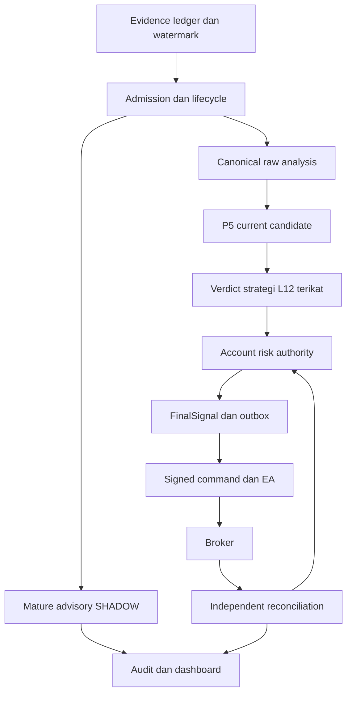
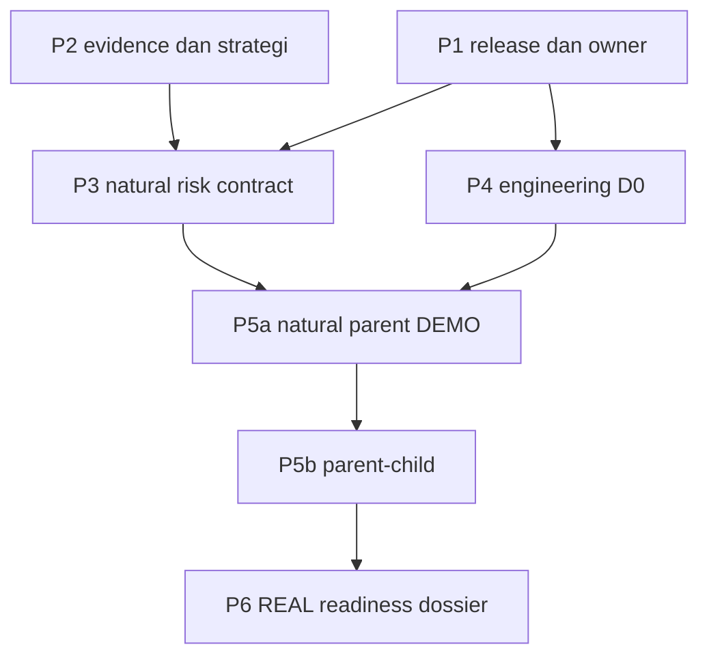

BLOCKED — status pelaksanaan GOAP; assessment dan rancangan sudah selesai. Langkah implementasi berikutnya terdefinisi, sedangkan source changes, deployment dan trading belum dijalankan dalam scope perencanaan ini.

# WOLF15 — Program Perbaikan Terpadu Menuju Otomasi 5S-CR di MT5

Tanggal baseline: 8 September 2026 (UTC). Mode: assessment berbasis source + rancangan implementasi. Repository: `tjx578/TUYUL-FX-WOLF-15LAYER-SYSTEM`. Main yang diperiksa: `1837f4b7cbded620c35933af980e9abd166de39e`, tree `4a687c6669d9ed7d0da48cc5b20fcc005b2ad59a`. Laporan ini mengonsolidasikan assessment terdahulu, membedakan bukti baru dari bukti historis, dan menentukan pekerjaan konkret. Status tindakan per ticket berada dalam JSON GOAP dan CSV backlog pendamping.

**Penilaian utama: fondasi WOLF15 layak diteruskan, tetapi jalur natural 5S-CR → otorisasi risiko akun → MT5 → rekonsiliasi belum lengkap. Repo belum mempunyai bukti yang cukup untuk menjalankan live trading otomatis.** Penghambat utama adalah correctness, kontrak antar-komponen, dan bukti rilis. Belum ada pengukuran yang membenarkan kesimpulan bahwa CPU, jumlah agen, atau kurangnya indikator merupakan bottleneck utama.

**Rekomendasi: pertahankan monorepo dan komponen yang sudah bekerja, bangun satu jalur lengkap, lalu perluas.** Pisahkan D0 engineering DEMO, D1a natural parent DEMO, dan D1b parent-child. Kerjakan perbaikan data/strategi/risk paralel dengan D0. Pertemukan semuanya sebelum natural DEMO; jangan menganggap satu order canary sebagai pembuktian strategi.

## 1. Cakupan dan kekuatan bukti

Seluruh 25 input teratas diinventarisasi: 11 upload terbaru, termasuk empat ZIP, dan 14 dokumen/log sumber. Setelah arsip dibuka dan duplikasi konten disatukan, korpus relevan berisi **135 kemunculan file, 107 konten unik**: 34 Markdown, dua teks, 64 JSON, enam Python, dan satu JavaScript. Semua JSON dapat diparse; semua checksum yang dideklarasikan empat manifest paket cocok. Checksum membuktikan integritas konten, bukan kebenaran assessment.

| Keluarga sumber | Cara dipakai | Koreksi interpretasi |
|---|---|---|
| Assessment repo dan integration plan/evidence | Baseline F01–F22, runtime, auth, code debt, enam PR | Klaim lama diikat ulang pada source kritis; tidak menjumlahkan temuan duplikat sebagai bug baru |
| Assessment Railway dan audit evidence | 16 target logis, launcher, readiness, BFF, research, benchmark | Konfigurasi repo bukan bukti seluruh layanan berjalan |
| Lanjutan assessment + GOAP + paket bukti | Konflik C01–C17, risk/EA contract, perubahan versi | Keputusan desain, implementasi, pengujian, dan aktivasi dipisahkan |
| Review kode vs SSOT v3.1 + harness | Normalisasi/scanner/admission; diagnostik terbatas | Source unggahan berhasil dipetakan secara semantik ke main |
| Dokumen strategi V2/V3.1, audit V3, desain EA, brief, risk scenario | Intent dan aturan target | Versi audit V3 tidak otomatis berarti strategi V3; dua rancangan EA bukan duplikat identik |
| Dua salinan log dan roadmap | Bukti historis perilaku serta tujuan | Log bukan telemetry September dan bukan full raw ledger |

Pemeriksaan GitHub mencakup tree lengkap sebagai inventaris; source kritis diperiksa mendalam per domain. **Ini bukan klaim review baris demi baris terhadap seluruh 2.300 blob repo.** Enam PR mempunyai 54 pasangan PR/path, 52 path unik; 53 patch lengkap diperoleh, dan dokumen #414 diambil penuh. Ledger PR memberi 18 entri inspeksi semantik terarah dan 36 entri akuisisi/metadata saja; worker domain mempunyai coverage source tambahan yang tercatat terpisah. Jangan menjumlahkan rekaman source lintas-worker sebagai file unik.

Pemeriksaan baru yang benar-benar dijalankan:

- 11 diagnostik SignalThrottle pada bytes main dengan deklarasi AST/doubles terbatas; lima probe pure raw-builder. Beberapa hasil mengonfirmasi defect. Exit 0 berarti diagnostik selesai, bukan sistem lolos readiness.
- Tiga analisis merge tekstual atas file ekspor, tanpa mengubah repository: konflik protokol delapan region; containment satu; migration-ownership test satu.
- AST seluruh 33 header migration main dan tiga tambahan PR; pemeriksaan parent/head graph. SQL/Alembic tidak dijalankan.
- Pembacaan ulang metadata branch, CI, PR dan source; manifest Git blob per domain.

Full test suite, combined build, PostgreSQL/Redis integration, MetaEditor, terminal/broker, OOS dan profitabilitas **belum dibuktikan dalam audit ini**. Lampiran layanan membedakan setiap observasi cloud yang berhasil didapat dari konfigurasi source.

## 2. Kondisi objektif repo

| Dimensi | Yang sudah ada | Batas saat ini | Putusan |
|---|---|---|---|
| Evidence dan strategi | Raw dedup, lifecycle V2 durable, P5 structural candidate | Parity scanner/replay, admission arah/gap, policy V3.1 dan net geometry belum konvergen | Dapat diperbaiki secara bertahap |
| Risk | Decimal, transaksi/lock akun, snapshot, outbox | Jalur canonical yang diperiksa parent-only SHADOW; beberapa jalur legacy memakai state/risk yang tidak cocok untuk authority | Natural DEMO belum tersedia |
| Execution | Signed wire, derived HMAC per executor, HTTPS pull, durable marker pada candidate EA | Canary membatasi strategy authority; clock/recovery/independent reconciliation perlu ditutup | Fondasi baik, acceptance belum lengkap |
| Integrasi PR | Enam candidate PR dan test yang bernilai | Semua masih open/unmerged; konflik protokol dan dua schema head pada convergence | Tidak boleh merge massal tanpa resolusi |
| Layanan | Launcher tersedia; 20 service cloud dan latest deployment metadata berhasil diobservasi | Parity artifact belum terikat; source readiness/ownership/freshness mempunyai gap, dampak deployment aktual belum diukur | Perbaiki jalur aktif terlebih dahulu |
| Rilis | Workflow, lint/test/coverage policy | Branch tidak terlindungi pada observasi; gate/deploy binding belum terbukti memadai | Belum ada release evidence yang cukup |
| Performa dan strategi | Microbenchmark historis serta log pressure | Tidak ada baseline end-to-end atau bukti keuntungan OOS yang memenuhi target | NOT_MEASURED / NOT_ESTABLISHED |

Sepuluh workflow main terbaru yang diambil memuat enam failure dan empat skipped. Pada commit main ada 33 check runs: 29 failure dan empat skipped. Namun keenam job dalam CI run yang diperiksa mempunyai `steps=[]` dan `runner_id=0`. **Data ini tidak membuktikan enam test kode gagal; tidak ada bukti job tersebut mulai menjalankan langkahnya.** Penyebab runner/scheduling harus dilihat dari annotations/log atau konfigurasi yang berwenang, bukan ditebak sebagai billing. [CI run yang diperiksa](https://github.com/tjx578/TUYUL-FX-WOLF-15LAYER-SYSTEM/actions/runs/34021697792).

Log unggahan berisi 580 record unik secara berkas, bertanggal 9–13 Juli 2026, pada 19 symbol: seluruh record `PRESSURE_ONLY`, `final_direction=WAIT`, `valid_for_execution=false`. Artinya sampel ini menggambarkan pressure/advisory yang tidak memberi izin order. **Mengubah WAIT menjadi EXECUTE agar terlihat aktif justru salah sasaran.** Sampel tersebut tidak mengukur kesehatan September, bukan full raw history, dan tidak membuktikan strategi tidak pernah menghasilkan trade.

## 3. Akar masalah yang harus menjadi satu backlog

Severity berikut menyatakan dampak apabila jalur terkait dipakai. Temuan source tidak otomatis berarti insiden produksi telah terjadi. Referensi S-/E-/R- dan F/C historis dijabarkan dalam memo domain serta backlog; tabel ini menduplikasi pekerjaan berdasarkan akar masalah, bukan jumlah laporan.

| Akar masalah | Bukti dan dampak | Solusi konkret | Prioritas |
|---|---|---|---|
| Rilis tidak terikat bukti kandidat | Workflow/gate lama, branch policy, CI tidak mulai; #413 hanya pressure-outbox | Satu manifest source/image/config/schema/EA; gate fail harus fail; workflow-run memakai SHA pemicu; cakup setiap target deploy | Sebelum deploy kandidat |
| Owner proses dan readiness tidak sama | Embedded state, detached probe, fatal hold/route failure tidak selalu membuat readiness gagal | Role manifest, satu owner per scope, liveness berbeda dari readiness, supervisor task dan reason yang aktual | Sebelum D0 pada jalur yang dipakai |
| Evidence dapat stale, tak lengkap, atau terhitung berulang | Timeout thread tidak menghentikan worker; cache stale; scanner duplicate/material inflation | Bounded I/O/queue, explicit event/available/as-of time, completeness watermark, idempotency dan dedup material | Sebelum natural strategy |
| Admission berbeda dari SSOT | Direction change memotong raw block; gap finalizes; advisory admission belum terikat penuh | Reducer admission berversi, conflict sebagai quality, suspension+backfill, current eligibility terpisah dari history | Sebelum natural strategy |
| Aturan target tidak menjadi kontrak tunggal | V2/V3.1, gross/net RR, instrument floor, enum/contoh pressure tidak konsisten | Registry versi/digest, decision table, generated examples, instrument cost/geometry contract | Sebelum replay yang dinilai |
| Capital-risk natural belum tersambung | `5scr-tradeplan-v2` versus `5scr-plan`; projection bukan reservation; legacy account singleton | Adapter berversi, canonical eligibility, account lock, non-overlap exposure, durable leg slot/reservation/FinalSignal/outbox | Sebelum natural DEMO |
| DEMO canary bukan natural strategy | #419 menolak risk reservation dan strategy lineage; #418 menjaga authority false | Explicit natural command class, producer, EA validator dan report reducer; preserve canary lane | Sebelum natural DEMO |
| Telemetry belum menjadi bukti broker independen | Boolean executor dipakai untuk reconciliation gating pada candidate canary | Principal attestor terpisah, immutable proof, completeness/freshness, account/challenge binding | Sebelum D0 broker |
| Delivery, submit dan broker outcome perlu lifecycle terpisah | Quote-clock timer, not-before claim, ambiguous crash/partial fill/cancel | Timer monotonic, durable submit marker, unknown hold, idempotent observations, broker-linked reducer | Sebelum D0/natural sesuai scope |
| Technical debt menutupi kegagalan dan mengganggu diagnosa | BFF status masking, auth outage401, perf guard false-pass, research default tak cukup | Typed dependency errors, truthful readiness/exit, repo-native correctness gates, research terisolasi | P1 pada jalur aktif; sisanya paralel |

**Temuan strategi baru yang paling jelas:** raw-builder main menghasilkan tiga block 0 detik untuk satu symbol dengan BUY@0, SELL@150, BUY@300, sedangkan tiga BUY menghasilkan satu block 300 detik. V2 dan V3.1 menempatkan direction conflict sebagai kualitas evidence, bukan syarat seleksi pair. Perbaikannya harus memberi pair akses analisis dengan label conflict; bukan memberi izin BUY/SELL. [Raw block reducer](https://github.com/tjx578/TUYUL-FX-WOLF-15LAYER-SYSTEM/blob/1837f4b7cbded620c35933af980e9abd166de39e/analysis/strategy_5scr_raw_admission_blocks.py#L308), [admission evaluator](https://github.com/tjx578/TUYUL-FX-WOLF-15LAYER-SYSTEM/blob/1837f4b7cbded620c35933af980e9abd166de39e/analysis/strategy_5scr_pair_admission.py#L299).

Sebaliknya, raw builder sudah berhasil mendedup 100 delivery identik menjadi satu event. Defect scanner tidak boleh digeneralisasi menjadi “seluruh raw ledger tidak idempotent”. Begitu pula lifecycle durable V2 sudah ada; perlu evolusi kontrak dan wiring, bukan membangun ulang semuanya.

## 4. Arsitektur target dan batas otoritas

View berikut adalah **TO_BE**, untuk owner implementasi dan reviewer. Ia menampilkan authority, cabang advisory dan feedback broker. Current module-to-module evidence berada di `strategy-master.md`, `execution-master.md`, dan `services-master.md`; diagram ini tidak mengklaim seluruh edge sudah beroperasi.

FinalSignal adalah artefak keputusan final tunggal yang memuat verdict strategi yang sah dan otorisasi risiko akun. **Kontrak otoritas TO_BE: L1–L11 menganalisis/memvalidasi; hanya L12 yang terikat source/version mengeluarkan verdict strategi.** Backend risk secara terpisah memeriksa akun/exposure dan menyetujui final size; final builder menyimpan FinalSignal setelah keduanya valid. Journal hanya mencatat; enrichment tidak menaikkan authority. Ini tidak mengklaim runtime L12 atau seluruh 15 layer sudah terhubung. Mapping P5 candidate→verdict L12 beserta setiap mandatory gate setelah verdict harus eksplisit dan berversi; gate yang belum diketahui tidak dianggap lulus.

Signed command adalah pembungkus mekanis untuk pengiriman, binding dan idempotency. Advisory, dashboard, hasil penelitian maupun LLM enrichment tidak menambah lot, mengganti SL/TP, atau meningkatkan authority. Label `valid_for_execution=true` pada suatu projection rehearsal tidak mengalahkan source class, mode, guard dan authority flags yang membatasinya.

| Data | Pemilik authoritative | Aturan |
|---|---|---|
| Raw event, coverage, revision | Ingest/evidence ledger | Event time dan available time terpisah; missing range tidak dianggap complete |
| Episode, thesis, box, candidate | Engine/strategy repositories | Current revision/eligibility terpisah dari highest historical authority |
| Kapasitas akun dan campaign/leg | PostgreSQL risk repository | Atomic check+reserve; account-wide filled/pending/reserved/unknown |
| FinalSignal, command, submit disposition | Backend durable repositories | Stable identity, immutable payload, outbox, no blind resubmit |
| Order/deal/position dan hasil ekonomi | Broker evidence yang direkonsiliasi | ACK atau `OrderSend=true` belum fill |
| Status operator/analytics | Projection yang dapat dibangun ulang | Read-only terhadap keputusan strategi dan capital authority |

Keputusan arsitektur yang diusulkan:

1. **Reuse modular monorepo, PostgreSQL dan HTTPS pull.** Pertahankan existing Railway project/domain dan batas layanan. Kafka, service per tabel, atau platform multi-agent baru belum menjawab gap yang terbukti.
2. **Satu runtime owner per scope.** API menangani ingress; existing orchestrator mengatur lifecycle; engine menentukan strategi; risk mengotorisasi capital; bridge/EA mengirim. Single writer untuk state tidak berarti seluruh sistem harus serial. Gunakan account-scoped concurrency dan fencing/lease sesuai sink.
3. **Authority tersurat per kelas command.** SHADOW projection, engineering canary dan natural DEMO terpisah; unknown class fail closed. Buat versi baru saat semantik berubah; jangan membuka generic LIVE fallback.
4. **Append-only proof, transaksi pendek, pemulihan eksplisit.** Hindari network/LLM call ketika lock akun dipegang. Cache tidak menambah headroom risiko. Gunakan existing signing per executor; crypto overhaul bukan prerequisite otomatis.
5. **Parent-only sebagai tahap kemampuan awal.** D1a membuktikan natural path terbatas. D1b tetap wajib untuk menyebut target parent-child 5S-CR terpenuhi. Ini usulan rollout, bukan penggantian strategi permanen.

Untuk koordinasi engineering, empat domain paralel terbukti cukup memisahkan pekerjaan: strategi, execution/auth, layanan, integrasi PR. Sintesis dilakukan dengan exact refs dan conflicting findings, bukan voting. Tidak ada bukti bahwa pergantian model, routing agen dinamis atau agen tambahan memberi speedup; itu bukan bagian wajib release.

## 5. Kontrak 5S-CR yang harus dibekukan

Pertahankan intent desain V3.1 yang sudah dinyatakan; tidak perlu mengulang persetujuan desain umum. Yang harus dibuat adalah **binding teknis yang dapat diperiksa**: approved document digest, strategy version, audit version, risk profile, implementation SHA, dataset/replay digest, schema serta deployment mode. Status draft PR dokumen tidak dengan sendirinya membatalkan intent user, dan intent tersebut tidak membuktikan runtime sudah memakai versi yang sama.

| Area | Keputusan kontrak yang dibutuhkan | Acceptance |
|---|---|---|
| Pair admission | Kontinuitas pair sesuai rule300s; arah sebagai quality; gap sebagai suspension | Mixed direction tidak menghilangkan eligibility analisis; gap/backfill tidak fork episode |
| Dual admission | Canonical raw versus mature advisory | Advisory full SHADOW analysis menghasilkan nol reservation/order; upgrade meminta re-evaluation |
| Pressure direction | RADAR_ONLY versus explicit consolidated direction contract | Majority summary bukan proof LOCKED; mode×alignment×domain mempunyai hasil tunggal |
| Structural sequence | Closed H1 sebelum ordered M15 confirmation; box dan target as-of | Evidence yang baru available setelah keputusan ditolak dalam replay |
| Target/SL/RR | Nearest valid H4 target, structural SL sebelum feasible interval, metric net/gross tersurat | BUY/SELL mirrored; biaya positif; target tidak dipindah lebih jauh demi RR |
| Instrumen | FX/JPY/metals mempunyai geometry dan spec broker yang sesuai | Unsupported symbol ditolak; tick/volume/stop rules teruji, bukan konversi pip generik |
| Risk profile | Equal parent-child atau asymmetric DEMO merupakan profile berbeda | Tidak mencampur parameter dari dokumen berbeda dalam satu campaign |
| Child | Satu lifetime slot, syarat parent/child structure dan risk release eksplisit | Parent floating profit dengan SL statis tidak dianggap risk yang sudah dilepas |

Dokumen risk equal-entry memberikan contoh parent5% dan child5% pada basis campaign yang dibekukan: pada $1.000 berarti budget rencana $50+$50, bukan total $50. Dokumen DEMO3,5%+≤1,5% adalah profile lain. **Laporan ini tidak memilih atau mengaktifkan persentase baru.** RR1,5 di source dan catatan1:2 juga tidak boleh disatukan diam-diam. Pilih satu versioned policy sesuai keputusan yang berlaku sebelum membuat hasil replay yang dibandingkan.

Sizing harus memakai balance/account scope yang benar, harga/spec broker, quantity-step floor dan loss oracle dalam mata uang akun. Jika volume aman di bawah minimum broker, hasilnya reject; minimum lot tidak menjadi alasan membulatkan risiko ke atas. `OrderCalcProfit` membantu menghitung estimasi hasil dalam account currency, lalu biaya/slippage policy harus diperhitungkan secara eksplisit. Planned loss-at-stop bukan jaminan batas kerugian ketika terjadi gap. [MetaQuotes OrderCalcProfit](https://www.mql5.com/en/docs/trading/ordercalcprofit).

## 6. Sambungan natural DEMO yang belum tersedia

Main reservation menerima identitas `5scr-plan`, sedangkan P5 V2 menggunakan `5scr-tradeplan-v2`. #418 adalah **shadow risk projection**, dengan `capital_reserved=false` dan `order_send_eligible=false`. Main producer tetap SHADOW. EA #419 sengaja menolak strategy/risk lineage. Karena itu **merge #418+#419 atau mengganti flag tidak menyelesaikan natural DEMO**. [Risk contract main](https://github.com/tjx578/TUYUL-FX-WOLF-15LAYER-SYSTEM/blob/1837f4b7cbded620c35933af980e9abd166de39e/contracts/strategy_5scr_risk_reservation.py), [projection #418](https://github.com/tjx578/TUYUL-FX-WOLF-15LAYER-SYSTEM/blob/a28ee83b838df259f89a87153f16d2c4cac3dc92/contracts/strategy_5scr_shadow_risk_projection.py), [EA #419](https://github.com/tjx578/TUYUL-FX-WOLF-15LAYER-SYSTEM/blob/3f4b8293c6c70b010bbbb85306379ba54079e125/ea_interface/wolf15_executor/Wolf15_DumbExecutor_Demo.mq5#L441).

Kontrak baru harus membawa minimal: natural source class; strategy/risk policy version; candidate revision dan evidence hashes; account/server/executor/session binding; verified reconciliation; reservation/campaign/leg; frozen symbol/side/order type/volume/entry/SL/full TP1; broker spec digest; not-before/submit/pending expiry; stable intent/command identity; signed payload; report/attempt identity. Gunakan field existing bila semantiknya tepat, tanpa protokol paralel yang hanya mengganti nama.

Tiga transaksi dengan owner jelas:

1. **A — admission/reserve:** lock akun dan candidate aktif, validasi verdict L12 dan mandatory gate menurut mapping versi terpilih, validasi policy/spec/snapshot/reconciliation, klaim leg slot, simpan reservation + FinalSignal + outbox secara atomik.
2. **B — publish:** revalidasi reservation dan governance, buat command deterministik dan signed bytes, simpan binding/disposition. Snapshot superseded harus reject atau melalui reauthorization berversi yang dapat diaudit; jangan mengganti proof di payload lama.
3. **C — observations/reconcile:** append report idempotent, rekonstruksi broker state dari observasi, pindahkan exposure antarbucket secara atomik, lepaskan hanya bagian yang sudah dibuktikan tidak lagi berisiko.

Exposure admission: `filled_loss_at_stop + pending_unfilled_risk + reserved_unsubmitted_risk + unknown_submission_risk`. Setiap unit risiko berada dalam satu bucket. Partial fill40% dari reservation50, pada contoh linear, berarti filled20+pending30; confirmed cancel residual melepas30. Delivery expiry tidak otomatis membatalkan pending order broker. Parent closed tidak otomatis membuat child closed.

Untuk independent reconciliation, pisahkan principal executor, issuer dan collector. Proof harus punya account/purpose/challenge binding, freshness, query completeness/errors, orders/positions/deals/history coverage, normalized digest dan immutable verdict. Backend menghitung status verified; EA tidak dapat menetapkannya melalui heartbeat boolean. Jika sumber independen unavailable, status UNKNOWN/SOURCE_UNAVAILABLE menahan new risk, sementara pengumpulan bukti tetap berjalan.

EA perlu monotonic timer untuk heartbeat/poll/recovery; quote age tetap diperiksa sebelum submit. Simpan backend acknowledgement dan local submit marker sebelum kemungkinan broker effect. Crash setelah marker berarti zero atau one submission mungkin terjadi; recovery tidak melakukan blind retry. `OrderSend=true` bukan bukti fill, dan urutan trade transaction tidak dijamin. `WebRequest` sinkron serta tidak tersedia di Strategy Tester; compiler/tester harus dilengkapi terminal integration. [OrderSend](https://www.mql5.com/en/docs/trading/ordersend), [OnTradeTransaction](https://www.mql5.com/en/docs/event_handlers/ontradetransaction), [WebRequest](https://www.mql5.com/en/docs/network/webrequest).

## 7. Integrasi PR: urutan berdasarkan kebutuhan

| PR | Disposisi | Batas yang harus dipertahankan |
|---|---|---|
| #413 | Ambil prinsip exact SHA dan release gates; sesuaikan per target | Implementasi PR spesifik pressure-outbox, bukan seluruh Railway |
| #414 | Bind dokumen V3.1 dan tutup konflik contoh/enum/policy | Dokumen bukan aktivasi strategi |
| #415 | Integrasikan perbaikan correctness/evidence pada baseline main | Historical test claim tidak menjadi combined PASS |
| #416 | Ambil satu delta unik sesudah #415; audit callsite | Return type HealthProbeRuntime berubah; broken caller belum terbukti |
| #418 | Pertahankan sebagai projection/SHADOW lane; integrasikan sebelum natural | Jangan menaikkan authority proyeksi; perlu convergence dengan main |
| #419 | Basis D0 engineering dengan perbaikan attestation/clock/recovery | Tidak menerima natural strategy; compile closure termasuk include SHADOW |

Source graph main mempunyai head `20260822_01`; main+#419 satu head `20260823_01`; main+#418+#419 mempunyai dua head `20260813_04` dan `20260823_01`. **D0 tidak perlu menunggu #418.** Untuk convergence, pertahankan history yang pernah diterapkan, kemudian gunakan additive merge/remediation migration. Reparent hanya layak setelah seluruh environment terkait terbukti belum menggunakan migration tersebut. Applied DB heads belum diamati; source DAG bukan bukti upgrade berhasil.

Resolusi protokol delapan region harus mempertahankan union source/guards beserta validator pasangan dan mode. Jangan memilih seluruh `ours`/`theirs`; jangan memakai `source_event=signal_json` sebagai discriminator tunggal. Pertahankan observer allowlist main pada containment test dan behavior/exit-redaction tests #415 pada konflik #413. Bind binary EA kepada semua include, compiler build dan artifact hash, bukan hanya satu `.mq5`.

## 8. Enam milestone, dengan pekerjaan paralel

Ini satu program perbaikan dengan enam hasil; ticket rinci dan dependensinya ada pada CSV/GOAP. Nomor milestone menyatakan hasil, bukan perintah agar setiap baris menunggu seluruh milestone sebelumnya.

| Milestone | Output yang dituju | Pekerjaan utama | Syarat keluar |
|---|---|---|---|
| **P1 — Release dan runtime dapat dipercaya** | Kandidat source terikat, owner/gate/readiness jelas | CI failure propagation, exact deploy SHA, scoped runner, required routes/tasks, migration owner, jalur legacy terisolasi | Gate berjalan pada kandidat dan service readiness menjelaskan kegagalan yang nyata |
| **P2 — Evidence dan strategi deterministik** | Same evidence+policy menghasilkan same decision | Normalizer/material dedup, timeout/freshness, direction/gap admission, durable lifecycle/advisory, geometry/net-cost | Replay parity, no future evidence, advisory nol capital authority |
| **P3 — Risk dan natural contract lengkap** | Current P5 → reservation → FinalSignal → natural signed command | Versioned adapter, account ledger, immutable risk basis, outbox/reducer, EA class | Concurrency/restart/partial-fill/expiry negative tests pada source/schema gabungan |
| **P4 — D0 engineering MT5 terbukti** | Satu bounded canary dengan outcome independen | Main+#419 minimal, shared timer, attestor, exact EA build, D0 schema/deploy | Maksimum satu logical submit, outcome terverifikasi, zero unresolved before rearm |
| **P5 — Natural DEMO 5S-CR** | D1a parent alami, lalu D1b parent-child/compounding | Convergence P2/P3/P4, natural schema, SHADOW, natural trigger, child lifetime/risk semantics | Rantai lineage end-to-end dan lifecycle lengkap; D1a tidak dihitung complete D1b |
| **P6 — Bukti kesiapan REAL** | Dossier teknis, strategi dan operasional | Frozen OOS, DEMO observations, execution costs, recovery drills, policy/account scope | Review bukti dan keputusan promotion terpisah; tidak ada REAL enable otomatis |

Baseline patch pertama: release workflow dan failure propagation, single-owner/readiness, shared EA timer/claim recovery, lalu normalized evidence/admission. Auth attestor dapat dikerjakan paralel dengan data/strategy. Natural schema/risk/producer/EA diselesaikan sebagai satu contract closure, bukan ticket risk yang dianggap otomatis membuat seluruh jalur berfungsi.

Estimasi jadwal, biaya, critical path waktu dan speedup **NOT_MEASURED**. Dependency graph menunjukkan urutan kausal; bukan janji selesai dalam sejumlah hari. Ukur durasi satu vertical slice pada runner dan lingkungan yang sebenarnya sebelum memberi tanggal live. Dedicated Linux runner baru adalah pekerjaan CI yang terpisah dari terminal MT5; existing host/workload dan dashboard tidak dijadikan sasaran perubahan tanpa kebutuhan yang dibuktikan.

## 9. Layanan, bottleneck dan efisiensi

Inventaris source mempunyai 14 config Railway untuk 16 target logis termasuk PostgreSQL/Redis. **Observasi cloud baru pada 8 September 2026 18:08:48 UTC menemukan 20 service objects** pada project WOLF-15 LAYER, production. Metadata latest deployment seluruh service tercakup. Dedicated orchestrator benar-benar ada; latest metadata menunjuk `2c099aef5900b30433624c62a3273243f4596437`. Tiga research job menunjuk `7c45484e9124bb4a8a745dc1ef8832a7745ea58c`, migrator `bbc3205be53e8266243934519b20b1577db305b1`. Banyak service inti tidak menyertakan commit/image pada metadata. Perbedaan commit belum membuktikan file yang relevan berbeda secara semantik; kesamaan dengan main juga belum terbukti.

Ada maintenance, auditor, schema-patch, lock-flush, signalthrottle dan `WOLF15-DASHBOARD` yang perlu dipetakan role/entrypoint-nya. Dua dashboard mempunyai UUID berbeda. Tidak adanya nama literal BFF atau allocation tidak membuktikan role tersebut absen. Nama cloud Monte Carlo adalah `wolf15-worker-montercarlo`; manifest deploy harus memakai service UUID agar tidak salah target. Tidak ada env/secret atau tindakan mutation dibaca/dijalankan dalam observasi metadata ini. Rincian dan receipt tersedia pada `services-railway-supplement.md` serta `services-railway-observation.json`. [Project Railway yang diperiksa](https://railway.com/project/af4d15d8-d4cb-44b7-80e7-d99a37ca0045).

Status SUCCESS adalah metadata deployment; bukan bukti useful work, continuous health, D0 atau broker reconciliation. Applied database heads, effective runtime config/replica, actual terminal dan account state masih belum diukur. Pemisahan prioritas:

| Kelompok | Target | Perbaikan yang berdampak langsung |
|---|---|---|
| Ingress/control | wolf15-api, wolf15-orchestrator | Required-router boot errors membuat ready=false; hilangkan owner ganda; truthful supervised lifecycle |
| Data/strategy | ingest, engine, pressure-outbox | Stable warmup epoch, fresh complete data, bounded I/O, material watermark, progress/oldest pending |
| Capital/delivery | trade/execution, allocation, EA bridge | Role/mode preflight, account lock, distinct ports, signed authority, outbox recovery |
| Operator | dashboard BFF dan frontend | Upstream outage menjadi dependency error yang benar; token invalid berbeda dari auth unavailable; retry/logout tetap dapat digunakan |
| Storage/schema | migrator, PostgreSQL, Redis | Satu migration owner; applied-head proof; PG authority, Redis cache; lease release token-checked atomik |
| Research | backtest, Monte Carlo, regime | Batch/job semantics, finite input, minimum sample/preflight, nonzero failure exit; tidak menjadi authority order |
| Role tambahan cloud | maintenance, auditor, schema-patch, lock-flush, signalthrottle, dashboard kedua | Bind UUID→entrypoint/artifact/permission; maintenance one-shot dengan receipt; jangan menganggap nama function memberi izin membersihkan lock atau mengubah schema |

Engine detached default-ready probe dan fatal hold yang kembali normal menuntut pengawasan task yang nyata. API yang kehilangan router wajib juga tidak boleh dianggap ready hanya karena heartbeat/feed lolos. Railway sendiri memeriksa health endpoint ketika deployment berlangsung, bukan monitoring berkelanjutan; tambahkan continuous runtime observation sesuai operasi yang dipilih. [Railway healthchecks](https://docs.railway.com/deployments/healthchecks).

Bottleneck yang layak diukur setelah correctness:

- Residence time source→available→admission→analysis→risk→publish→claim→submit→reconcile, dengan correlation ID dan queue age.
- Timeout count, worker masih aktif setelah deadline, provider error/quota, cache age/completeness dan oldest dirty watermark. Bounded coalescing mencegah duplikasi analisis tanpa membuang material revision.
- PostgreSQL lock wait/transaction duration/deadlock, outbox oldest pending, repeated superseded-snapshot rejection, unresolved exposure age.
- CPU/RSS/GC dan retained-candle growth per service; gunakan measured bottleneck untuk memilih worker pool/process, bukan menambah thread tanpa batas.
- Broker retcode, slippage, partial fill, reject/cancel/fill ambiguity, heartbeat gap dan pending report backlog.

Microbenchmark historis campaign-risk: median sekitar334ms untuk10.000 siklus/70.000 pemanggilan dalam proses lokal, tanpa baseline pembanding. Dependency Pydantic receipt berbeda dari pin repo. Ini **bukan latency sebuah trade**, bukan performa PostgreSQL/broker, dan bukan bukti optimasi deployment. Pertahankan status `MEASURED_NOT_COMPARED`; ulang pada release environment hanya ketika dipakai sebagai acceptance performa.

Code debt ditangani dengan perbaikan scope aktif, compatibility tests dan pengurangan duplikasi setelah parity. Pisahkan modul scanner hampir4.800 baris secara bertahap menjadi normalization, material evidence, scanner projection dan report; pure reducer dan repo durable tetap terpisah. Jangan mengubah histori replay saat memindahkan fungsi. Pin resolved runtime dependencies untuk artifact rilis; audit rentang dependency tidak sama dengan bukti CVE, dan upgrade massal bukan pekerjaan pertama.

## 10. Acceptance, rollback, dan keputusan promotion

| Gate | Bukti minimum | Kondisi stop |
|---|---|---|
| Source/release | Combined commit/tree, selected deltas, candidate CI receipt, image/config/schema/EA include hashes | SHA berubah, gate tidak berjalan, artifact tidak cocok |
| Strategy | Frozen rule/dataset/as-of; parity dan negative authority; H1/M15/target/cost fixtures | Future evidence, duplicate material inflation, unsupported policy |
| Account/risk | Dua akun/concurrent workers, loss oracle/spec binding, atomic reserve and role slot | Stale/incomplete account, nonfinite values, below-min sizing, unknown exposure |
| Broker recovery | Crash sebelum/sesudah submit, partial fill, cancel-versus-fill, restart, report reorder | Ambiguous submit, missing independent evidence, account/session mismatch |
| D0 | Exact DEMO account, scoped canary window, bounded effect, verified outcome | Zero fresh quote/reconciliation, wrong artifact or wrong mode |
| Natural DEMO | Current canonical episode sampai broker result, no manual signal substitution, full declared order-mode lifecycle | Canary dianggap natural, advisory menciptakan risk, child capability belum teruji |
| REAL readiness | Preregistered OOS criteria, independent DEMO cost/reliability observations, operations/recovery and financial policy | Threshold dipilih setelah hasil terlihat, unknown loss state, evidence belum cukup |

Tidak menetapkan target win-rate, latency percentile atau jumlah hari DEMO tanpa data/keputusan yang sah. Tentukan metric dan acceptance threshold sebelum evaluasi; reliability invariant seperti nol duplicate logical submit pada setiap fault scenario adalah assertion correctness, bukan proyeksi profit.

Rollback code memakai patch/branch terisolasi dengan pre-existing changes dipertahankan. Database memakai additive migration dan rehearsal dari applied head yang diketahui. Setelah command/reservation atau broker effect ada, jangan menghapus ledger atau menurunkan schema untuk membuat test hijau. Hentikan new risk, teruskan report/reconciliation, kemudian forward repair. Broker effect tidak dapat dibatalkan oleh rollback Git; compensating trade adalah tindakan keuangan tersendiri.

Penugasan owner pada backlog merupakan role engineering yang diusulkan. Perubahan repo, provisioning runner, policy GitHub, migration/deployment dan order belum dilakukan oleh laporan ini. Permintaan saat ini dituntaskan sebagai assessment dan rancangan menyeluruh; setiap langkah eksternal mempunyai objek/artifact dan bukti penerimaan yang harus konkret sebelum dijalankan.

## 11. Cara menggunakan paket ini

Gunakan laporan ini sebagai program induk. CSV/GOAP memuat pekerjaan dan dependensi; memo domain menyediakan source anchor, contoh kontrak dan acceptance rinci; receipt memberi cakupan eksekusi aktual. Jika commit/policy berubah, refresh hanya evidence yang terpengaruh dan invalidasikan acceptance turunannya. Jangan mengulang assessment seluruh repo untuk setiap patch.

Mulai dari release/owner correctness dan admission yang terbukti bermasalah. Bangun natural risk→producer→EA→reconciliation sebagai satu kemampuan terikat. D0 mempercepat pembuktian terminal; P2/P3 berjalan paralel; parent-child menyusul sesudah parent natural memenuhi acceptance. Penambahan fitur riset, kompleksitas orchestration, serta optimasi skala menunggu jalur ini memberikan bukti yang dapat diukur.

**IMPLEMENTATION=NOT_EXECUTED; COMBINED_RELEASE=NOT_VALIDATED; AUTOMATIC_REAL_TRADING=NOT_ENABLED.**
