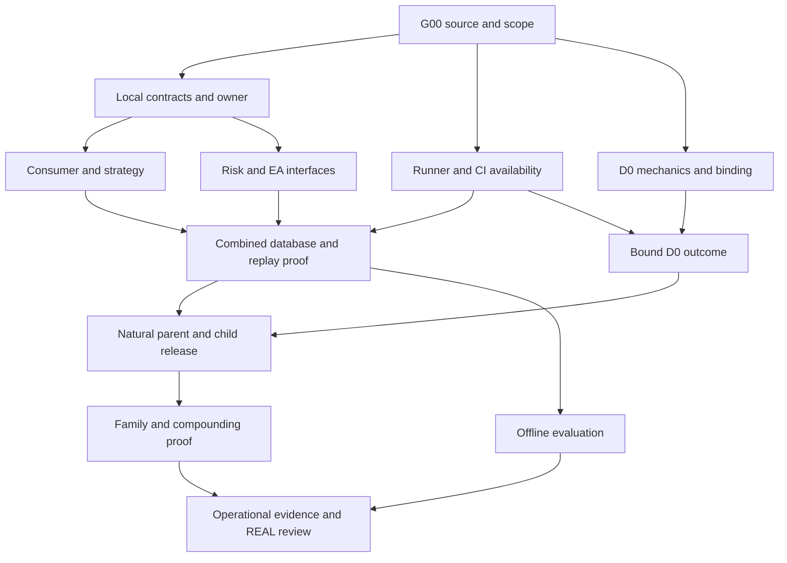

PARTIAL_PLAN — Langkah dan kriteria goal lengkap; pengujian runtime, akses runner, CI dan binding operasi masih mempunyai prasyarat terbuka.

# WOLF15 — Kontrak Goal Pursuit P1–P6 untuk Codex Desktop

**Tujuan paket:** memberi Codex Desktop satu kontrak kerja yang dapat dilanjutkan lintas sesi, mengurangi pertanyaan berulang, memperkirakan kegagalan, dan menutup pekerjaan berdasarkan outcome yang dapat dibuktikan. Penyusunan paket selesai sebagai pekerjaan perencanaan; implementasi repo, migrasi, deploy dan broker tidak dijalankan oleh penyusun.

Tanggal paket: 9 September 2026; gunakan UTC dan WITA pada receipt. Basis status terbaru adalah laporan pengguna tentang PR #428, bukan audit remote baru. SSOT tetap **v3.1 yang dipilih di repository**. README tidak diperbarui.

## Cara menggunakan paket

1. Ekstrak seluruh ZIP ke satu folder yang dapat dibaca Codex Desktop.
2. Buka repository WOLF15 yang benar dan berikan instruksi dari [START_CODEX_DESKTOP.md](START_CODEX_DESKTOP.md). Desktop wajib memverifikasi source terbaru sebelum menerapkan rencana.
3. Gunakan [peta 41 aksi](WOLF15_ACTION_MAP.md) dan [GOAP JSON](WOLF15_PURSUIT_PLAN.json) untuk dependency; [failure playbook](WOLF15_FAILURE_PLAYBOOK.md) untuk diagnosis/resume; [binding template](WOLF15_BINDING_INPUTS.template.json) dan [state template](WOLF15_PURSUIT_STATE.template.json) untuk input dan checkpoint.
4. Validasi integritas paket dengan `python tools/validate_pursuit_package.py`. Hasilnya memeriksa dokumen/rencana, bukan kesiapan sistem trading.

Navigasi: [Goal](#1-definition-of-goal-dan-terminal-state) · [Otonomi](#3-scope-otonomi-dan-pertanyaan-yang-benar-benar-diperlukan) · [Scheduler](#4-scheduler-agar-pursuit-terus-bergerak) · [P1](#12-p1-seluruh-canonical-action-ids) · [P2](#13-p2-seluruh-canonical-action-ids) · [P3](#15-p3--capital-risk-dan-natural-execution-contract) · [P4](#16-p4--engineering-d0-end-to-end) · [P5](#17-p5--natural-parent-child-compounding) · [P6](#18-p6--operational-dan-strategy-evidence-real-review).

## 1. Definition of Goal dan terminal state

### 1.1 Goal yang harus dicapai

`NATURAL_DEMO_DONE`: canonical evidence alami → admission v3.1 → durable lifecycle → context/thesis/geometry sah → source-bound strategy verdict dan mandatory gates → account-risk/reservation/FinalSignal → signed natural command → EA mekanis pada akun DEMO terikat → broker outcome → rekonsiliasi independen. Jalur tersebut mencakup **parent, child yang sah menurut policy, dan compounding campaign berikutnya**. Parent-only adalah tahap rollout.

`REAL_REVIEW_DONE`: seluruh O01/O02/O03 beserta dependency wajib menghasilkan evidence memadai dan penilaian kesiapan REAL yang beralasan. Verdict dapat HOLD bila evaluasi lengkap gagal memenuhi kriteria. Bukti yang tidak pernah dikumpulkan tidak boleh dianggap review selesai.

`PROGRAM_GOAL_COMPLETE = P1–P5 mandatory closure AND P6 review closure`. `REAL_READY_FOR_REVIEW` adalah status tambahan yang memerlukan kelulusan semua kriteria relevan. `REAL_ACTIVE` berada di luar goal paket ini. Dossier yang lengkap tidak menghapus defect keselamatan pada P1–P5 atau otomatis memberi izin operasi.

### 1.2 State tidak saling menggantikan

| State | Definisi |
|---|---|
| SOURCE_IMPLEMENTED | Kode/kontrak ada pada revision terikat |
| VERIFIED_LOCAL | Tes lokal dalam scope yang dinyatakan benar-benar lulus |
| VERIFIED_DATABASE | Migrasi dan perilaku PostgreSQL aktual dalam scope telah dibuktikan |
| VERIFIED_COMBINED | Source gabungan, schema, konfigurasi dan EA lulus required gates yang relevan |
| VERIFIED_BROKER | Outcome pada akun/binary/window terikat direkonsiliasi dari reader independen |
| ACTION_DONE | Seluruh acceptance action dan hard dependency penutup terpenuhi |
| MILESTONE_DONE | Semua action dan extra gates milestone terpenuhi |
| BLOCKED_EXTERNAL | Frontier tertentu tidak bisa dijalankan karena input/capability/otorisasi eksternal yang benar-benar belum tersedia |

Jangan mengubah enum register repo sembarangan. State di atas dapat menjadi kolom pendamping atau mapping eksplisit. Simpan `execution_stage`, `evidence_status`, dan `closure_status` terpisah. Satu milestone belum DONE tidak berarti semua pekerjaannya belum dimulai.

### 1.3 Done umum

Setiap penutupan memerlukan requirement/policy yang terikat, outcome positif yang dimaksud, negative/fault coverage relevan, source dan fixture identik dengan evidence, seluruh required checks pada scope, recovery yang relevan, dan nol blocker wajib yang belum diselesaikan. Numerator/denominator dan alasan exclusion harus tersedia. Nol qualifying occurrence berarti NOT_OBSERVED, bukan 100% PASS.

`D0_OUTCOME_DONE` dapat mencatat broker rejection yang jelas bila kontrak E09 memang menutup outcome tersebut. Laporkan `BROKER_FILL_PROVEN=false`. Natural parent/family memerlukan bukti positif kemampuan yang ditargetkan; jangan menggunakan rejection D0 untuk menutup P5.

## 2. Source binding dan checkpoint awal

Mulai dari PR #428, branch `codex/s03-runtime-recovery-20260909`, source commit `5219624a92253b66fe8bc67a1acace99b71e61e7`, publication HEAD `01fd6f9c1d0e34dc896eace92c81083e2b718653`. User melaporkan remote cocok dan worktree bersih. Main saat ini harus ditemukan kembali; jangan menggunakan SHA main historis sebagai current truth.

Bukti yang dilaporkan: producer evaluation/snapshot/counter-row/outbox atomik pada source; immutable payload relay dengan predecessor ACK dan relay lease fencing; migration 20260909_02 offline; 176 local tests passed. Existing45 PG dan7 producer/relay PG masih skipped. Consumer transaction, shared lifecycle fencing legacy, authenticated consumer transport, active policy dan DEMO binding masih terbuka. CI ubuntu-latest terblokir account lock billing menurut annotation platform yang dilaporkan. Agent review independen akhir belum tersedia pada checkpoint tersebut.

`source_commit` dan `publication_head` bukan selalu sama. Commit dokumentasi dapat menunjuk source yang identik; buktikan dengan source tree/file hashes dan diff, jangan menolak atau menerima hanya karena dua SHA berbeda. Sebaliknya perubahan executable/config/schema/test memerlukan re-evaluasi scope evidence.

G00 melakukan read-only discovery: workspace aktual, instruction hierarchy, remote/repo identity, branch/HEAD/PR state, clean/dirty inventory, SSOT path/blob/digest, current register 41, run manifests dan capabilities. Baca full OID; short SHA hanya label. Gunakan `rg`/`rg --files` untuk menemukan runner/test/manifests aktual. Command instalasi, entrypoint, migration dan pytest dipilih dari source revision tersebut; paket ini tidak mengarang path script yang belum diperiksa.

Sumber normatif utama adalah selected repo SSOT, contracts/policies dan keputusan pengguna yang berlaku. Salinan `sources/ssot-v31-historical-reference.md` disertakan hanya untuk traceability, bukan pengganti file repo. Ketidaksediaan salinan assessment lama tetap dicatat sebagai gap parity; jangan meminta ulang pilihan v3.1 atau menghalangi seluruh engineering bila kontrak yang diperlukan sudah jelas pada repo.

Jangan menghapus/menimpa 46 perubahan lama bila masih ada. Gunakan worktree terisolasi bila checkout bersama kotor. Hindari reset/clean menyeluruh. Rebind jika main/PR berubah; integrasikan delta relevan dan review konflik tanpa membuang guard API-only/readiness/immutable evidence.

## 3. Scope otonomi dan pertanyaan yang benar-benar diperlukan

Paket ini adalah rencana. `START_CODEX_DESKTOP.md` adalah instruksi implementasi yang dapat diadopsi pengguna. Setelah scope itu berlaku, Codex tidak perlu meminta ulang untuk membaca source, merancang dan memperbaiki kode, worktree terisolasi, fixture, tes lokal/disposable yang scope-nya sah, review, commit dan publikasi branch Draft yang terikat.

| Kelas tindakan | Perlakuan |
|---|---|
| Read-only audit, diagnosis, source/receipt comparison | Lanjutkan dalam akses yang tersedia |
| Reversible source/test/schema edits, isolated build/test | Lanjutkan di scope engineering yang diotorisasi; resource test harus terisolasi dan sah |
| Commit/push branch remediasi | Lanjutkan bila scope instruksi/sesi mencakup publikasi; periksa hook/automation agar tidak memicu deployment di luar scope |
| Resource baru, billing, admin/ruleset, penghentian workload existing | Gunakan otorisasi yang sudah berlaku; bila tidak ada, siapkan perubahan/target/impact yang konkret dan minta hanya keputusan yang belum ada |
| Merge main, migrasi target produksi, Railway release | Verifikasi gate perubahan dan binding tindakan; reuse otorisasi valid pada scope-nya. Jangan menganggap semua 6 milestone harus selesai untuk setiap partial merge |
| DEMO order/campaign | Account/server/mode/EA/window/caps/reader/gates dan otorisasi bounded harus semuanya cocok |
| REAL activation | Tidak termasuk paket ini |

Rule baru pada dokumen ini tidak boleh mencabut otorisasi pengguna yang sudah berlaku. Perubahan hash memerlukan binding evidence yang sesuai; tidak otomatis berarti meminta izin ulang bila otorisasi memang mencakup perubahan itu. Sebaliknya nama file `approved`, label PASS, atau pilihan VPS baru tidak menjadi bukti host/provisioning/mandat broker.

Selesaikan proposal yang dapat ditinjau sebelum meminta keputusan: exact target, diff/artifact, config/schema, scope waktu/cap, expected effect, gates dan recovery. Bagi input menjadi tiga cohort agar tidak memaksa owner menjawab data masa depan terlalu dini: **runner/platform**, **policy dan account/reader**, lalu **paket operasi release/DEMO**. Tanyakan seluruh hal yang benar-benar belum diketahui pada cohort yang siap secara bersamaan. Jangan meminta token/password atau DSN berpassword; gunakan referensi konfigurasi/secret existing.

Bila aturan sistem/tool atau automatic approval review menolak tindakan, jangan memodifikasi instruksi untuk melewatinya. Catat tindakan dan alasan penolakan; ambil alternatif yang secara material lebih aman jika ada. Jelaskan alasan konkret kepada owner sekali setelah pekerjaan persiapan selesai.

## 4. Scheduler agar pursuit terus bergerak

Plan JSON memuat **41 canonical closure actions + G00 +12 local implementation slices =54 nodes**. G00/K01–K12 bukan milestone baru dan tidak mengubah ID register 41. Dependency canonical mengatur penutupan; local slice memungkinkan pembuatan kode/fixture sebelum runtime gate eksternal terpenuhi.

Urutan awal: G00 → import evidence valid → K01/K02 bila masih ada gap → **K03 consumer/shared fence/transport**. K10 hanya memeriksa delta gate yang nyata; producer/relay dan evidence runner yang sudah ada tidak dibangun ulang tanpa bug.

Diagram hanya ringkasan dependency pekerjaan. Bukan deklarasi urutan runtime L1–L15. DAG JSON adalah rujukan dependency action yang rinci; gunakan namespace `action.D01` versus `delivery.D01`.

Loop keputusan:

1. Import source/state; tandai evidence stale hanya untuk scope yang berubah.
2. Bangun ready frontier dari prerequisite yang benar-benar terpenuhi dan kewenangan/capability aktual.
3. Pilih slice yang menutup gap goal; dahulukan consumer saat ini, bukan optimasi atau tampilan.
4. Implementasikan bounded change, tes oracle yang relevan, review, simpan receipt, checkpoint owned changes.
5. Jika berhasil, update evidence dan pilih frontier berikutnya; jika gagal, diagnosis satu failure class, perbaiki penyebab, ulangi hanya affected scope serta required gates.
6. Jika external blocked, pindah ke sibling independen. Catat satu blocker dengan recheck trigger.
7. Jika tidak ada executable frontier, berikan `BLOCKED_EXTERNAL` handoff lengkap dan satu input/action owner yang dapat membuka frontier. Jangan busy polling atau berulang kali meminta input yang sudah dinyatakan tidak tersedia.

K01/K04/K06 dan bagian P3 dapat memakai named TEST_ONLY fixtures untuk mekanik; active risk/strategy policy tetap unbound sampai sumbernya sah. Jangan mengisi unknown policy lalu menyebut generic test sebagai acceptance policy aktif.

Durasi, biaya dan critical-path waktu **NOT_MEASURED**. Urutan dipilih dari dependency dan gap yang dilaporkan; paket tidak menjanjikan selesai dalam N hari. Ukur durasi aktual per slice dan runner sebelum memberi forecast waktu.

## 5. Anti-loop, retry, resume dan eskalasi

Blocker key = cause + affected dependency + subject/scope. State menyimpan `first_seen`, `last_evidence`, `searched_locations`, `attempted_resolution`, `owner`, `asked_once`, `answer_ref`, `recheck_trigger`, dan `independent_work_remaining`.

Tiga blocker yang sudah diketahui: Linux disposable belum bound; GitHub account-lock annotation terkait billing; paket runtime DEMO belum lengkap. Jangan mengulang diagnosis billing dari runner_id=0 atau mencoba rerun pada keadaan sama. Billing tetap dikecualikan sampai ada instruksi baru yang eksplisit. Nol self-hosted runner tidak menyatakan kapasitas GitHub-hosted tidak ada.

Proses retry yang disarankan: satu diagnosis berbatas pada failure signature baru; ulangi setelah source/input/capability benar-benar berubah. Ikuti retry/timeout policy repo untuk runtime. Angka resource, timeout, freshness, risk dan soak tidak ditetapkan sembarangan dalam paket. Gunakan guard yang memang berlaku pada runner tersebut; guard Windows historis tidak otomatis menjadi threshold Linux baru.

Jangan mengubah assertion, membuat skip/xfail, menurunkan required-test count, menghilangkan schema constraint, menghapus ledger, atau mengganti native integration dengan fake agar PASS. Kesalahan fixture dapat diperbaiki bila expectation diturunkan dari kontrak dan perubahan direview.

Resume setelah konteks hilang:

- Baca state, selected source, last successful receipt, owned-change inventory dan blocker queue.
- Cocokkan byte/artifact yang penting sebelum reuse PASS; pemindahan file/reformat JSON yang mengubah digest memerlukan rebinding receipt.
- Bila PR yang sama sudah merged, temukan merge/base aktual dan siapkan follow-up branch sesuai scope; jangan menganggap branch lama masih current.
- Pertahankan failure receipts. Local source PASS dapat direuse untuk source identik, tetapi bukan pengganti runtime/CI/broker gate.
- Laporkan delta status, bukan mengulang seluruh assessment. README tetap tidak diubah.

## 6. Definition of Done P1–P6 dan bukti penutup

| Milestone | Definition of Goal | Closure tambahan |
|---|---|---|
| P1 | Jalur release, role ownership, mandatory readiness dan governance dapat dipercaya | Required CI benar-benar berjalan sesuai kebijakan; built artifact/runtime fault proof, bukan metadata flags |
| P2 | Evidence/admission/lifecycle/geometry v3.1 deterministik dan durable | 35 klausul terpetakan; caller→consumer dan PG restart/race terbukti; dataset/as-of/policy bound |
| P3 | Current strategy dan independent account-risk menghasilkan natural contract/EA yang kompatibel |Combined schema/protocol/MetaEditor/transaction/recovery tests pada artifact terikat |
| P4 | D0 engineering DEMO terbatas mempunyai outcome independen |Final SHADOW nol submit; scope canary sah; unknown outcome tidak ditutup melalui retry |
| P5 | Parent alami, child legal dan next-campaign compounding berjalan |Parent/child masing-masing punya release evidence; broker lifecycle positif dan reader independen |
| P6 | Evaluasi operasi dan ekonomi/strategi lengkap dengan verdict REAL beralasan |Protocol preregistered, actual cohorts/SLO/recovery evidence; review lengkap dapat HOLD; REAL tetap terpisah |

P1 bukan tuntutan agar seluruh 20 service selalu RUNNING. Buat disposition tiap service UUID: mandatory release role, optional/isolated, atau intentionally disabled dengan alasan dan boundary. Service optional yang gagal tidak boleh mengubah authority atau menghasilkan false ready. Scope WOLF15-DASHBOARD-FRONTEND existing Railway tetap dipertahankan bila disentuh oleh release; tidak dipindah ke provider baru sebagai jalan pintas.

Seluruh 41 IDs dan dependency tersedia pada `WOLF15_ACTION_MAP.md`; detail per action pada bab domain berikut. Status source lama di dokumen sumber tidak mengalahkan checkpoint baru yang terverifikasi oleh Desktop.

## 7. Evidence contract dan pengujian

Setiap receipt mengikat run_id/nonce, action dan requirement refs, source commit/tree/file hashes, publication HEAD bila berbeda, SSOT/policy/config/schema, runner/environment/version, fixture/test identities, timestamps UTC/WITA, command/output, actual vs expected, numerator/denominator, reviewer dan recovery. Parameter database identity/config sebelum/sesudah harus cocok dengan invariant yang dimaksud; data test dan perubahan schema yang memang direncanakan tidak disamakan dengan drift tak sah.

Inventaris saat ini:45 existing PG dan7 producer/relay PG, keduanya belum dieksekusi menurut laporan. Tambahan consumer dipetakan ke **delivery.D01–D11 dari file aktual**, lalu required inventory diperbarui eksplisit. Jangan mengarang nama/testcase ID. Count176/126/241/613/434 berasal dari run yang overlap; jangan dijumlahkan sebagai cakupan unik.

Skenario prioritas: consumer commit → relay lease expired → ACK ditolak → redelivery pada lease baru → dedup committed inbox tanpa extra effect → ACK valid → successor maju. Uji terpisah stale owner/legacy writer, rollback producer counter/outbox, predecessor missing, payload conflict, source backfill dan advisory→canonical.

Protokol MT5: successful OrderSend bukan bukti fill; satu request dapat menghasilkan beberapa event/callback. ACK bridge/EA dan bool reconciliation tidak menggantikan independent orders/deals/positions/history. Binding token/account/window salah atau output reader tak lengkap mempertahankan unknown. [OrderSend](https://www.mql5.com/en/docs/trading/ordersend), [OnTradeTransaction](https://www.mql5.com/en/docs/event_handlers/ontradetransaction).

Counter producer saat ini dilaporkan row-transaksional. Pertahankan desain yang terverifikasi; PostgreSQL native sequence dapat memiliki gap karena allocation tidak dikembalikan saat rollback. Jangan membuat consumer menunggu nomor yang tidak pernah committed. Lock ordering dan fence harus diuji pada transaksi write, bukan hanya pada startup. [Sequence](https://www.postgresql.org/docs/17/functions-sequence.html), [Locking](https://www.postgresql.org/docs/17/explicit-locking.html).

GitHub-hosted Linux dan self-hosted registry berbeda. Service PostgreSQL dalam CI memerlukan runner/network topology sesuai workflow; itu tidak mengatasi account lock platform. Linux manual/disposable memberi bukti engineering terpisah dan tidak otomatis menggantikan required remote checks. [Self-hosted runner API](https://docs.github.com/en/rest/actions/self-hosted-runners#list-self-hosted-runners-for-a-repository), [PostgreSQL service containers](https://docs.github.com/en/actions/tutorials/use-containerized-services/create-postgresql-service-containers).

## 8. Binding dan checkpoint operasi

`WOLF15_BINDING_INPUTS.template.json` adalah template non-executable, semua input belum diketahui null. Cari existing registry/receipt terlebih dahulu, isi hanya reference yang nyata dan sah. Jangan menaruh secret/nama akun privat dalam source publik. Detail akun dapat berada pada binding privat dengan identitas terproteksi, bukan harus dipublikasikan ke GitHub.

Sebelum D01/E07/D02/N05/J02/J03, wajib ada C05 closure serta binding required checks/governance ke candidate release saat itu. Verifikasi ulang identity dan validity setiap release; PASS sebelumnya bukan boolean global. Controls existing yang sudah memadai boleh ditutup sebagai verified no-op tanpa izin admin mutasi. Sebelum tiap release runtime, siapkan packet: actual service UUID/target, exact source/image/config/schema/EA binary, bound current account/server/mode, instrument/window/caps, reader identity, gate receipts, migration/backup/recovery dan scope authorization. Template yang terisi teks tidak otomatis valid; verifikasi bukti target nyata dan authority.

D0 engineering, natural parent, dan natural family mempunyai operasi/window/artifact berbeda. Tidak perlu meminta ulang keputusan yang masih berlaku, tetapi jangan menggunakan parent-only permission untuk kemampuan child yang tidak tercakup. Freshness evidence harus diperiksa lagi ketika window dimulai; authorisasi valid tidak membuat data lama fresh.

## 9. Rollback dan stop conditions

| Boundary | Respons bila gagal | Yang dipertahankan |
|---|---|---|
| Owned source/worktree | Simpan failure receipt; revert patch milik slice atau perbaiki terarah | Semua perubahan sebelum task, input, bukti, branch lain |
| Disposable database | Hentikan suite, simpan log/metadata; reset hanya fixture/schema disposable yang dimiliki dan diizinkan | Database produksi/shared dan forensic evidence |
| Applied target migration | Stop new-risk release; gunakan compatible artifact/forward repair atau rollback yang telah diuji pada scope | Applied history, ledger, reservations dan broker exposure |
| Runtime delivery | Quarantine konflik pada scope yang tepat; tunggu predecessor/reconcile; jangan bypass cursor/fence | Immutable payload, inbox/outbox, mapping dan cursor history |
| Broker submission ambiguous | Tahan new risk/rearm; lanjut reader/reconciliation dan proteksi yang diotorisasi | Unknown exposure tetap diperhitungkan; jangan blind resend/close-all |
| Adverse performance evaluation | Selesaikan analisis dengan verdict jujur; lakukan remediasi yang terdefinisi | Dataset, preregistered threshold dan hasil negatif |

Source rollback tidak membatalkan broker order. Satu logical submit dapat mempunyai banyak deal/transaction record; duplicate effect ditentukan linkage, bukan menghitung semua callback sebagai order baru.

## 10. Koordinasi dan pengukuran

Pola awal yang disarankan: satu coordinator + sampai dua worker untuk source domains independen, hanya bila tools/quota dan resource tersedia. Coordinator memegang integrasi protokol/migrasi dan state goal. Satu file hanya punya satu penulis aktif. Reviewer tidak mereview pekerjaannya sendiri sebagai independent review.

Ukur per slice: wall time, resource peak yang tersedia, waktu menunggu dependency, jumlah conflicts/rework dan status reviewer. Catat biaya sebagai NOT_MEASURED bila tidak tersedia. Adaptasi topology hanya jika evidence menunjukkan contention, idle wait, quota, atau overlap file; jangan menambah agent sekadar memberi label canggih. Bila agent quota habis, lanjut serial pada pekerjaan yang sah dan laporkan review independen belum dilakukan; mandatory reviewer gate tetap dihormati.

Kasus unavailable evidence yang sudah diantisipasi: code source snapshot terbaru tidak dapat diambil dalam sesi penyusun; Desktop G00 wajib memverifikasi. Agent laporan sebelumnya terbatas quota; paket ini tidak mengubah self-review menjadi independent PASS. Linux/CI/broker facts yang hilang hanya memblokir dependent gate, bukan semua local source work.

## 11. Definisi handoff akhir

Handoff minimum berisi exact source/branch, worktree status, owned changes, closures dengan evidence, invalidated/stale receipts, blockers dan lokasi pencarian, keputusan yang sudah berlaku, runner scope, next executable action, serta satu kebutuhan owner bila seluruh frontier terblokir. `GOAL_COMPLETE` hanya ketika seluruh scope goal selesai; bila masih ada missing mandatory evidence gunakan `BLOCKED_EXTERNAL` atau `IN_PROGRESS` sesuai frontier.

Jangan menyatakan tanpa risiko, profit terjamin, production-ready, atau all-system-done karena hash/testcount/deploymentSUCCESS saja. Debt nonblocking yang ditunda mempunyai owner, dampak dan alasan; jangan menambah fitur baru untuk mengejar label high-end.

## 12. P1: seluruh canonical action IDs

### A00 — source acquisition, sudah DONE untuk scope asal

- **Severity bila gagal:** HIGH evidence integrity; mengaudit revision yang salah dapat menghasilkan gate palsu.
- **Langkah:** baca exact PR/main refs, full OID dan worktree status; catat source tree + SSOT binding + source manifest. Pertahankan source tests source commit dan publikasi docs HEAD secara terpisah. Bandingkan file source bila commit publikasi hanya docs.
- **DoD:** subject yang dipakai setiap run dapat ditelusuri; original input preserved. Jangan mengklaim rebind baru sebagai seluruh engineering selesai.
- **Kegagalan diproyeksikan:** main maju/PR berubah; dirty worktree; file assessment Windows tak tersedia; old source bytes berbeda newline.
- **Recovery:** preserve patch/hash; worktree baru dengan base yang diketahui; reconcile hanya perubahan relevan; tentukan bukti mana stale. Dokumen lama yang tak tersedia tidak menghalangi implementasi menurut selected repo SSOT, kecuali clause penting masih ambigu. Semantic parity lama tetap OPEN.

### C01 — exact source release

- **Dependencies:** A00. Existing patches sebelumnya dilaporkan tersedia; audit delta terlebih dahulu.
- **Langkah:** telusuri seluruh entry deploy otomatis/manual, termasuk `.github/workflows/railway-deploy.yml` dan pressure-outbox. Pastikan checkout/build/release menerima full reviewed source dan receipt checks pada subject yang sama. Capture source, image digest, config digest, schema head dan daftar service UUID/role di release manifest. Periksa perubahan command deploy yang berupa Markdown Windows sebelum menjadikannya command.
- **DoD:** CI untuk A tidak dapat melepaskan B; missing receipt, source mismatch, migration failure dan subprocess nonzero menggagalkan release. Valid source positif terbukti melalui lane yang dibolehkan. Kontrak local runner bukan deployment proof.
- **Projected failure:** TOCTOU saat main maju; image rebuilt dari mutable tag; staged Railway config memuat perubahan orang lain; ignored subprocess exit.
- **Recovery:** refresh candidate binding pada change yang material; preserve pinned image; siapkan exact scoped patch dan inspect staged diff. Bila platform write tersedia tetapi staged change lain tidak bisa diseleksi, simpan proposal dan lanjut lane lain; jangan deploy gabungan yang tidak ditinjau.

### C02 — satu owner dan isolasi legacy

- **Dependencies:** A00. API-only/embedded rejection sudah dilaporkan; bukti runtime masih perlu.
- **Langkah:** petakan roles existing `wolf15-api`, dedicated `wolf15-orchestrator`, engine, trade, pressure-outbox dan lifecycle writers. Pisahkan ownership orchestration/mode dari ownership data lifecycle; dedicated orchestrator tidak otomatis menjadi penentu arah atau lot. Semua writer yang menyentuh state sama wajib ikut lease/fence yang sama. Preflight menolak dual execution plane; jalur broker legacy diputus/diisolasi dengan trace recording sink.
- **DoD:** API tidak memulai embedded orchestrator; dual owner test membuktikan stale owner tidak menulis; required worker supervised; legacy broker dispatch zero pada input yang benar-benar melewati jalurnya; intentionally disabled tidak dianggap crash. Bukti konfigurasi saja tidak menutup owner runtime.
- **Projected failure:** cached owner state valid terlalu lama; old worker terbangun setelah lease berpindah; API startup melakukan DB/outbox mutasi; legacy writer tidak memakai fence.
- **Recovery:** validity check fence di transaksi write, bukan hanya startup; backend ownership store unavailable menghasilkan controlled HOLD untuk pekerjaan yang membutuhkan owner. Preserve read-only startup protections yang dilaporkan sudah diperbaiki. Jangan menghapus seluruh state untuk mengatasi dual owner.

### C03 — required gates jujur

- **Dependencies:** C01. Jangan menggabungkan historical PR #413/#415/#416 secara membabi buta bila delta sudah ada di main.
- **Langkah:** bandingkan acceptance existing pada CI, migration subprocess, perf guard, HealthProbeRuntime callers, API dependency pins dan fixture MCP. Pertahankan API Python/Pydantic pin dan isolate native MCP dependency lane. Runner database memakai test ID manifest, no-skip, nonce, before/after metadata dan immutable evidence yang telah dibuat. Review hanya celah konkret yang tersisa.
- **DoD:** required test failure/import error/empty selection/nonzero subprocess fail job; required skipped ditolak; MCP fixture lane tetap required bila repo mewajibkannya; positif actual run menghasilkan receipt utuh. Compile/static/offline SQL tidak substitusi database acceptance.
- **Projected failure:** environment API vs MCP Pydantic conflict; pytest exit 0 dengan skipped; xfail/parametrization mengubah collected IDs; GitHub job tidak mulai.
- **Recovery:** separate env sesuai requirement sebenarnya; reconcile expected ID manifest melalui review perubahan test, tidak menghapus hard cases. Catat Actions billing lock sebagai external cause; jangan rerun tanpa perubahan kondisi atau menaikkan status local menjadi remote PASS.

### C04 — runner Linux disposable

- **Dependencies:** A00 dan keputusan infrastructure yang sudah berlaku; tidak menganggap planning memberi authority billing/provisioning.
- **Langkah:** inventaris capability read-only; gunakan existing authorized equivalent clean runner jika benar-benar tersedia, terikat dan compatible. Prior choice adalah **host Linux baru**; dua historical VPS/Windows workloads tetap untouched. Registry runner minimal: hostname/alias atau identity, OS/runtime, capacity hasil probe, scope isolated database, source access, evidence directory, owner, lifetime/cost authority jika provisioning berbiaya. Secret hanya reference.
- **DoD:** identity/capacity sesuai workload; clean checkout dan disposable PostgreSQL/Redis dapat digunakan dengan bukti koneksi/versi/isolasi; bootstrap serta connectivity/isolation smoke benar-benar berjalan; resources dibuat/dihapus dalam scope yang terotorisasi dengan receipts. Acceptance migrasi program dan recovery ditutup pada S03/E04/N04/J01; tidak dituntut selesai dahulu untuk menyatakan runner C04 tersedia. Linux tersedia tidak otomatis berarti required GitHub checks hijau.
- **Projected failure:** host tidak tersedia, Windows memory 94–96%, Docker/WSL inactive, Actions account locked.
- **Recovery:** jangan tutup proses Windows, restart VM lama, ubah billing, memakai akun/VPS historis atau produksi sebagai test database. Siapkan bootstrap/run bundle dahulu; masukkan satu kebutuhan operator ke dependency queue. Lanjut S01/S04/S05/P3 yang tidak memerlukan runtime. Tidak ada resource threshold baru ditetapkan oleh notes ini; reuse guard runner yang memang berlaku.
- **Hal yang tidak perlu:** penambahan nonce/hashing/guard baru yang tidak menangani defect teridentifikasi. Runner terakhir sudah mempunyai per-run evidence binding.

### C05 — release governance

- **Dependencies:** C01 + C03, GitHub admin scope untuk mutasi rulesets.
- **Langkah:** baca rulesets/branch protection/check contexts dan authority bypass yang sudah berlaku; buat diff konkret untuk gap yang terbukti. Pisahkan reviewability PR partial, merge eligibility PR, deployment eligibility dan trading readiness. Tidak menunggu semua P1–P6 untuk menyatakan setiap partial PR dapat ditinjau.
- **DoD:** required checks/reviews untuk release branch berlaku pada source yang benar; alternatif deploy path tidak melewati equivalent controls. Bukti pengaturan dan rejection kasus invalid tercatat.
- **Projected failure:** context job berubah sehingga gate pending selamanya; required checks blocked billing; admin bypass dianggap solusi testing.
- **Recovery:** perbaiki context mapping secara reviewed; status BLOCKED_EXTERNAL sampai kondisi platform berubah. Jangan menonaktifkan required checks agar merge tampak selesai. External CI pengganti hanya sah bila governance repo memang menerima receipt equivalent tersebut, bukan keputusan agent sepihak.

### C06 — readiness dan supervisor nyata

- **Dependencies:** A00; runtime fault closure juga membutuhkan runner C04 untuk lane yang dipilih.
- **Langkah:** entrypoint smoke dari built image tanpa mount source untuk setiap required role; uji actual served `/readyz`, mandatory router import/mount, required task bootstrap/late crash, dependencies, single listener dan graceful shutdown. Health state berasal dari supervisor owner yang sama, bukan default-ready flags. Buktikan in-flight cancellation/shutdown berhenti sebelum DB pool ditutup.
- **DoD:** required failure → readiness 503 dan causal reason; fatal bootstrap/task → process nonzero sesuai bounded policy; optional intentionally disabled tetap distinguished; exactly one configured listener; graceful stop tidak salah fatal.
- **Projected failure:** thread mati tetapi HTTP 200; dua probe server berlomba port; background task gagal hanya logged; shutdown kehilangan pending candle/outbox evidence; stale cached state.
- **Recovery:** same supervisor state source untuk probe/task; explicit stop/join/drain/checkpoint order; readiness may hold while diagnostics available. Reuse configured bounds; jangan menjanjikan RTO tanpa measurement.

## 13. P2: seluruh canonical action IDs

### S01 — binding SSOT dan consumers

- **Dependencies:** A00. Path/blob/SHA binding, 15 rule groups, 35 clauses, 18 policy registries telah dilaporkan; kesetaraan old assessment bytes dan pengikatan seluruh consumer masih terbuka.
- **Langkah:** resolusi existing selected repo SSOT; table rule→schema→policy→producer→consumer→test→authority. Validasi generated examples/domain enums; tandai direction consumer V1 dan setiap adapter. Reuse approval versi v3.1. Gap parameter yang mempengaruhi strategi/risiko dikumpulkan menjadi decision record, tidak ditentukan dari memory contoh lain.
- **DoD:** selected rule/schema/policy-contract/authority mapping terikat dengan owner untuk seluruh mandatory rows; schema/examples valid; invalid/unavailable/conflicting policy contract ditolak sesuai reason. Explicit L1–L11 analysis/validation, L12 verdict dan post-verdict gates dipetakan dari source. S01 tidak mensyaratkan semua consumer sudah runtime: actual integration ditutup S04/S06/N04, active account-risk values oleh R01. Requirement itu tetap wajib pada owner tersebut. Tidak ada binding runtime inferred dari hash document.
- **Projected failure:** contoh JSON tidak sesuai schema, default config menyelundupkan V1, expiry accepted tepat valid_until, opposite direction inferred dari reject, diagram dan normative solver berbeda.
- **Recovery:** ikuti normative clause selected version; migrate adapter explicit + historical decoder; regression tepat sebelum/tepat/setelah expiry. Bug expiry V1 sudah reported fixed; pertahankan tesnya. Jika dua normative clauses benar-benar konflik dan berpengaruh pada order, isolate gate dengan reason dan minta satu decision terpaket setelah pilihan/impact konkret; kerja lain lanjut.

### S02 — market evidence yang dapat dipercaya

- **Dependencies:** C02. Periksa defect lama pada HEAD baru sebelum mengklaim masih terjadi.
- **Langkah:** source inventory WS/REST/cache/fallback/PG/Redis; log exchange/receive/available time, provider, revision, complete/closed flag, watermarks dan coverage. Terapkan selection policy per source dan retention. Lease renew/release owner-atomic; fallback membedakan forming vs closed. Quotes/heartbeat tidak membuat OHLC lama fresh.
- **DoD:** closed/as-of semantics consistent live/replay; no future-authoritative candle; selected candle revision PG/Redis sama; stopped feed menghasilkan stale/gap reason; overwrite closed oleh forming ditolak; reconnect tidak menghapus continuity gap; required coverage denominator tersedia.
- **Projected failure:** WS502/reconnect loop; timestamps salah zona; REST dan WS disagreement/drift; fallback dibaca fresh karena receive time baru; recovery mengambil legacy table; retention memotong episode prefix.
- **Recovery:** bounded retry sesuai policy + provenance-preserving fallback; conflicting providers diselesaikan selection policy versioned atau quarantine. Preserve closed monotonicity and gap state; recover dari canonical projection/ledger. Jangan menebak drift/freshness thresholds atau menyamakan harga beda source otomatis error salah satu.

### S03 — admission deterministic dan durable delivery

- **Dependencies:** S01. Producer/relay di PR #428 merupakan kemajuan, bukan mulai ulang. Hard acceptance database pending C04.
- **Langkah:** verifikasi normalizer producer→log→parser→replay, source logical observation identity, global ordering, episode/raw activity/revision identity. Kontinuitas pair dipisahkan direction quality. Preserve durable raw ledger, snapshot, evaluation, activity attachments, watermarks dan row counter/outbox transaction. Consumer transport menuntaskan bagian yang belum ada.
- **DoD:** valid fixture BUY@0→SELL@150→BUY@300 memberi satu 300 detik activity melalui caller, bukan hanya pure function; duplicate delivery/replay tidak menambah observation/pulse; ambiguous inter-symbol ordering ditolak; gap suspends sesuai continuity policy; backfill tidak me-rewrite history atau memberikan permission retroactive; fresh process restart dengan PostgreSQL mereproduksi outcome/identity; same ID/different payload quarantined.
- **Projected failure:** two legit facets dianggap dua pulses; arbitrary direction split; source gap diubah terminal/new episode; event available future masuk replay; replay dengan new delivery ID; snapshot out-of-order menimpa revision baru.
- **Recovery:** canonical observation reducer; keep immutable evaluation revisions, material/processed watermarks; coverage unknown stays unknown; guard stale writes. Existing V1 historical data perlu explicit compatible reader/migration, tidak diinterpretasi ulang diam-diam sebagai V3.1.

### S04 — consumer transaksional, dual admission dan lifecycle

- **Dependencies:** S03 + C02. Ini immediate implementation target.
- **Langkah consumer:**
  1. Temukan semua writer existing inbox/outbox/lifecycle/cursor/emission dan ownership scope yang sama. Periksa caller aktual, bukan file existence saja.
  2. Tetapkan consumer destination/authenticated principal serta delivery identity/payload validation; credential reference tanpa secret dalam docs.
  3. Dalam transaksi local consumer, lock/claim ownership sesuai scope dan verifikasi fence yang tidak bisa dilewati legacy writer. Proses inbox idempotent plus lifecycle + mapping + cursor + durable emission intent secara atomic.
  4. Owner lifecycle memilih lifecycle ID stabil; delivery baru tidak menciptakan lifecycle baru. Mapping aktivitas tidak reparent tanpa explicit transition contract. Sequence/predecessor gap tidak diabaikan.
  5. ACK application dibuat setelah commit consumer dan mengikat delivery/payload/consumer outcome sesuai kontrak. HTTP request received bukan commit proof. Same ID/same committed payload → return committed ACK tanpa extra effect; same ID/different payload → quarantine/reason, tidak maju cursor sebagai success.
  6. Side effect notifikasi eksternal menggunakan durable emission intent/outbox setelah local commit. Jangan menahan DB transaction sambil HTTP atau mengklaim atomic external send. Stable emission ID/dedup policy berlaku pada retries.
  7. Canonical raw dan qualifying mature advisory attach lifecycle yang sama menurut episode rules. Advisory memperoleh analysis, tetapi kandidat tetap SHADOW_ONLY/non-executable dan dilarang reservation/command. Upgrade raw menghasilkan re-evaluation dan candidate revision baru pada lifecycle yang sama.
  8. Evidence scheduler/single-flight coalesces material work, bukan menghilangkan material revision. Reject stale late results menggunakan generation/fence/current evidence revision; historical authority dan current eligibility dipisah.
- **DoD:** caller→producer→relay→consumer→lifecycle/emission intent berjalan end-to-end; transaction rollback zero partial DB effects; crash-after-commit/ACK loss repeated delivery zero duplicate lifecycle/emission; stale writer legacy rejected; qualifying advisory not dropped; fresh canonical upgrade keeps lifecycle and emits fresh candidate; forced slow job tidak overlap publish stale results.
- **Poin owner:** relay lease token melindungi ACK relay saja, tidak membuktikan lifecycle fencing. Owner tidak boleh hanya diverifikasi sebelum transaksi lalu write unconditional. Contention scope memakai actual lifecycle authority; tidak perlu global lock seluruh symbol jika source design menyediakan safe partitioning.
- **Projected failure utama:** consumer commit sukses, relay lease expired, ACK ignored, redelivery blocked forever. Oracle: redelivery on new lease returns same committed outcome valid ACK; successor dapat maju; duplicate effect 0. Fencing proof separate scenario: takeover rejects stale owner/legacy update and preserves state.
- **Projected failure lain:** poison payload memblokir seluruh stream; predecessor benar-benar hilang; ACK 2xx sebelum commit; duplicate ID unique violation swallowed dengan partial write; raw upgrade membuat lifecycle baru; work cancellation tidak menghentikan thread underlying.
- **Recovery:** quarantine/activity-level incident dengan policy explicit; tidak skip predecessor hanya untuk mengosongkan queue. Bukti ledger diperlukan sebelum controlled reconciliation/repair. Safe independent activities boleh maju bila ordering contract mengizinkan. Persist cursor/reason; jangan reset DB agar test hijau.

### S05 — geometry dan biaya v3.1

- **Dependencies:** S01. Patch pada solver dan adapters nyata, bukan symbol-specific new strategy.
- **Langkah:** H1 closed confirmation sebelum M15 structural sequence; reference solver normative §17.1; target universe mengikuti §17.2 selected SSOT, termasuk D1/H4/H1 dan legal structural sources. Correct historical backlog shorthand H4-only; ini fidelity fix. Structural stop → nearest fresh unconsumed target → feasible entry interval/net RR/costs; instrument specs explicit FX/JPY/metals. Bind contract policy RR/floor/TTL/costs, jangan pilih dari memory contoh yang konflik.
- **DoD:** mirror BUY/SELL dan ±tick boundary; nearer valid target tidak dilewati demi RR; empty interval tidak menjalankan fill search; fees/spread/slippage assumptions explicit/net; unsupported specs reject; no partial/future candles authoritative; candidate `valid_for_execution=false`; WAIT/NO_TRADE bukan win.
- **Projected failure:** gross RR dipakai sebagai net; hard-coded pip salah untuk metal/JPY; floored/rounded price menembus structural target/SL; historical fresh target ternyata sudah consumed; ambiguity §17 diagram vs solver.
- **Recovery:** instrument contract + Decimal/representability rules; rerun deterministic boundary fixtures; preserve current strategy authority (candidate tidak sizing authority). Policy belum bound menyebabkan gate pending, bukan arbitrary default baru.

### S06 — replay strategi end-to-end

- **Dependencies:** S02 + S04 + S05 + C04. Local pure replay bisa dikerjakan dahulu tetapi bukan closure final.
- **Langkah:** frozen dataset dan availability/as-of clock; bind selected source/policy/schema/environment; replay cold start dan recovered PostgreSQL state; compare stable IDs/hashes/reasons. Test corpus mencakup independent canonical/advisory/cohort ignored/incomplete cases. Petakan seluruh §24.1 15 assertions dan §24.2 20 zero-tolerance ke test+positive occurrence+denominator.
- **DoD:** same bound inputs menghasilkan identity/reason/output yang sama dengan exception nondeterministic metadata yang secara eksplisit dikecualikan dari material hash; all mandatory scenarios exercised; replay tidak memasukkan informasi yang belum tersedia saat keputusan; 45 + 7 existing dan consumer inventory berikutnya benar-benar dieksekusi tanpa skip pada lane PostgreSQL.
- **Projected failure:** hash mencakup wall-clock/telemetry dan berubah setiap run; empty cohort memberi 100%; new revision overwrite history; SQLite/FakeDB diklaim PostgreSQL recovery; conditional test skip diam-diam.
- **Recovery:** material field spec explicit; denominator zero → NOT_OBSERVED; synthetic fixture membuktikan mechanics saja, natural observational proof tahap P5 terpisah. Gunakan same run receipts, source after-run hashes dan database before/after identitas. Jangan menjumlah suite 176/126/241/613 yang overlap.

## 14. Acceptance delivery: jangan mengarang penomoran D01–D11

Nomor D01–D11 aktual harus dibaca dari `docs/remediation/2026-09-09/followup-producer-relay/acceptance-inventory.json` dan delivery contract/design pada source kandidat. Notes ini menetapkan skenario yang harus dipetakan, bukan mengklaim exact IDs:

| Skenario | Oracle minimum | Risk level |
|---|---|---|
| Two producer evaluations same material evaluation | Same original envelope/sequence; one immutable outbox effect | HIGH integrity |
| Producer rollback after sequence allocation | No committed orphan evaluation/snapshot/delivery/counter advancement inconsistent with contract | HIGH integrity |
| Same ID + changed bytes | Explicit quarantine; no overwrite/cursor success | HIGH integrity |
| Consumer crash before local commit | Zero partial inbox/lifecycle/mapping/cursor/emission intent | HIGH integrity |
| Consumer committed then ACK lost/relay lease expires | Retry recognizes committed payload, no duplicate effect, new valid ACK permits successor | HIGH recovery |
| Missing predecessor | No out-of-order application; explicit wait/incident and safe recovery | HIGH ordering |
| Two lifecycle owners or stale legacy writer | At most one valid owner mutation; stale fence rejected in write transaction | CRITICAL authority |
| Advisory→canonical upgrade | Stable lifecycle + fresh evaluated candidate; old advisory never executable | CRITICAL authority |
| Slow analysis returns after new generation | Old result cannot overwrite/currently authorize stale state | HIGH correctness |
| External notification outage | Durable intent retained; retry same emission identity; no fake broker authority | MEDIUM/HIGH observability |

CRITICAL/HIGH adalah severity per failure mechanism, bukan klaim insiden live saat ini. Blocking nature dinilai terhadap selected runtime path; fixture count tidak menjadi proxy probability.

## 15. P3 — capital-risk dan natural execution contract

Definition of Goal P3: canonical current candidate dengan authority lengkap dapat menghasilkan risk-authorized FinalSignal dan signed natural command yang kompatibel dengan EA serta schema gabungan, dengan semua gate required scope implementasi lulus. P3 tidak memerlukan broker aktif; P4/P5 menangani acceptance runtime/broker.

### R01 — ACCOUNT_RISK_PROFILE_BOUND

Dependency: S01. Owner: risk-policy owner + maintainer.

Langkah: cari registry dan binding account/mode/currency existing; cocokkan selected profile dengan source constitution; identifikasi parent/child budget, campaign cap, account total-risk cap, exposure caps, execution/cost policy, margins, snapshot freshness, drift, role slots dan release predicates. Buat object binding berversi serta examples/negative fixtures. Catat mana nilai normative selected, historical, proposed, atau unbound. Profile equal 5+5 dan DEMO 3.5+1.5 adalah dua profile berbeda. Parent-only rollout mengatur child disabled secara eksplisit, tidak mengubah definisi strategi keluarga akhir.

DoD: exact selected profile, account/mode/currency/versions bound; tidak ada nilai wajib dari fallback tersembunyi; validitas policy diuji, konflik dan policy tidak berlaku ditolak. Bila active policy belum diberikan, tandai `POLICY_BINDING_REQUIRED` dan selesaikan generic adapter/fixtures tanpa mengklaim R01 DONE.

Forecast/recovery: dua registry berbeda memberi angka berbeda → ikat sumber authority/policy yang berlaku, jangan ambil minimum/maksimum diam-diam. Account bukan USD → gunakan loss oracle/currency conversion sesuai broker contract, tidak memperlakukan tick value USD secara umum. Profile tidak mampu meluluskan minimum lot → reject sah, bukan clamp volume ke atas.

### R02 — CAPITAL_RISK_LEDGER_IMPLEMENTED

Dependencies: R01, S05. Owner: risk ledger maintainer.

Langkah: adapter atas current canonical candidate ID/revision dan complete proof; source-backed strategy/L12 verdict dan mandatory post-verdict gates tetap terpisah dari account-risk approval. Dalam bounded DB transaction kunci account capacity dan candidate revision; baca fresh bound snapshot/spec/reconciliation; pilih campaign/role slot; hitung broker-aware cash loss termasuk costs; floor volume ke step; simpan reservation, campaign/leg, immutable FinalSignal dan outbox atomik. Network/provider/LLM tidak berada dalam account lock. Kelola exposure reducer tanpa overlap: filled loss-at-stop + pending residual + reserved unsubmitted + unknown submit risk.

DoD: dua worker/candidate bersamaan tidak melampaui account/campaign cap; stale/missing snapshot/spec/attestation zero reservation; below-min reject; actual projected cash loss setelah rounding diverifikasi ulang; transition filled/pending/reserved/unknown disimpan konsisten; rolled-back transaction tidak meninggalkan FinalSignal/outbox. Uji pada PostgreSQL disposable wajib untuk klaim transaksi/race.

Forecast/recovery: legacy candidate regex `5scr-plan` vs current candidate ID → buat explicit adapter/schema, jangan string replacement. Snapshot baru tiap heartbeat menggagalkan publication → ukur material change dan residence time, lakukan explicit reauthorization berversi, jangan mengganti snapshot di signed proof. Partial fill 40% lalu cancel → lepaskan hanya residual yang broker-confirmed; unknown tetap dihitung. Deposit/manual trade/account switch → recompute current capacity dari fresh reconciliation; jangan ubah locked campaign R retrospektif.

### R03 — NATURAL_DEMO_CONTRACT_IMPLEMENTED

Dependency: R02. Owner: protocol maintainer.

Langkah: natural source class eksplisit yang berbeda dari engineering D0/projection; versi wire, exact current candidate/proof/reservation/account/spec/policy/reconciliation/deadline; action allowlist market/limit/cancel yang dipersyaratkan selected strategy. Ikat final builder ke source-backed L12 strategy verdict dan separate account approval; journal/enrichment tidak dapat override. Susun Python/MQL5 golden vectors canonical decimals, dates, ID, UTF-8/canonical serialization dan invalid-field cases.

DoD: current canonical positive fixture diterima; advisory, SHADOW projection, D0 engineering, stale historical highest-authority, missing post-verdict gate, wrong version atau malformed lineage ditolak; unknown field/unknown action treatment eksplisit; no silent downgrade. Candidate tetap `valid_for_execution=false` sampai pembentukan FinalSignal sah.

Forecast/recovery: old EA menolak natural lineage → pertahankan rejection; tambah natural-capable profile/build, jangan menghapus guard D0. Market canary test tidak mencakup retracement pending/cancel → tambahkan contract tests pada mode terpilih. Drift H4-only/legacy floor → resolve terhadap v3.1/policy bound, bukan menyamakan semua dokumen.

### N01 — NATURAL_SIGNED_PRODUCER_IMPLEMENTED

Dependencies: R03, E02. Owner: trade ledger maintainer.

Langkah: claim final-signal outbox; revalidate active reservation, governance, account/spec and proof; deterministic command ID; sign immutable bytes; insert command dan publication disposition dalam transaction. Audit supersession/reauthorization sebagai versi baru yang traceable; tak ada silent snapshot swap. Signed command tidak melepaskan risk reservation.

DoD: same FinalSignal/reservation memberi satu command; same ID/different payload rejects; crash/retry publication idempotent; inactive reservation dan invalid attestation zero command; setiap command mempunyai complete live lineage dan both strategy/risk approval.

Forecast/recovery: split transaction menciptakan published tanpa command → atomic publication dan recovery scan; exposure terlepas saat queue expiry → ubah release reducer sesuai broker outcome, bukan transport clock. Signature mismatch antarbasa → golden vectors dan byte-level comparison, bukan mengabaikan signature.

### N02 — NATURAL_EA_IMPLEMENTED

Dependencies: R03, E01. Owner: EA maintainer.

Langkah: reuse shared wire/journal/timer; profile natural dengan version/source/action allowlist. EA mechanical validation exact account/server/mode/session/executor/spec/quote/expiry/protection/volume; bisa reject, tidak recalc side/entry/lot/SL/TP/order type/risk. Backend submit permit/marker dan local durable submit marker harus berada sebelum broker side effect. Setelah blocking I/O, revalidate mutable mechanical fields. Unknown submission masuk recovery, bukan automatic resend. Tangkap broker events lokal cepat; reconciliation mengolah out-of-order/partial fill.

DoD: exact command representable; unsupported command rejected; SHADOW zero submit; wrong mode/account invalid; market/limit/cancel modes diuji sesuai selected contract; durable restart before/after marker; expiry/revocation/partial fill/cancel race; MetaEditor compile exact include closure dilaporkan terpisah dari terminal/broker tests.

Forecast/recovery: WebRequest/terminal tidak dapat dibuktikan oleh compile/fixture → terminal HTTP rehearsal E08/N05; no terminal capability catat blocker dan lanjutkan vectors/backend. Crash setelah marker dengan no visible position → reader query completeness/history dulu; kosong incomplete bukan proof zero effect. Local journal corrupt → hold new submit dan reconcile; jangan delete journal supaya EA kembali ready.

### N03 — NATURAL_COMBINED_SOURCE_FROZEN

Dependencies: N01, N02, E03, S04, S05. Owner: integrator.

Langkah: isolated integrated branch; converge strategy/lifecycle/risk/EA/protocol/migrations; source #418 dipakai hanya jika kebutuhan terpilih terbukti; preserve projection and observer boundaries. Source PR #428 consumer+shared fencing+auth transport menjadi S04 closure dependency, bukan dianggap beres karena producer dan relay tersedia. Review combined graph setelah latest main; freeze exact tree, schema/code/config/policy/EA closure.

DoD: satu source gabungan yang memang dapat dibangun; migration graph sesuai model repo dan applied history; tidak ada missing consumer/inbox/fence/writer route; no unclassified broker-capable path; all lineage IDs kompatibel. Source pada PR parsial saja tidak cukup.

Forecast/recovery: merge conflict pada shared wire/runtime ownership → resolve semantik dan test affected gates; jangan blind ours/theirs. Migrasi dua head → additive convergence berdasarkan actual applied history; jangan rewrite revision yang sudah diterapkan. Dirty unrelated46 changes → preserve isolated worktree/hash, tidak auto merge/reset.

### N04 — NATURAL_COMBINED_GATES_PASSED

Dependencies: N03, S06, C04; MetaEditor capability. Owner: validation.

Langkah: required clean Linux tests dan exact EA compile; disposable PG fresh+supported upgrade, race capacity, delivery/replay/partial-fill/cancel/out-of-order/unknown/revocation, advisory zero-sink and full lineage tests; verify source stable and test inventory/JUnit identities, zero required skip. Existing 45 + producer/relay 7 scopes dipertahankan; consumer/new tests diberi separate inventory dan combined proof, bukan dijumlahkan antar run.

DoD: seluruh required gate benar-benar executed pada exact combined artifacts dengan successful receipts dan migration metadata. Suite lokal 176/613 suite historis bukan pengganti. External CI account lock → evidence engineering di approved Linux runner dapat dikerjakan, tetapi required checks remote tetap unmet; jangan forge green checks atau bypass policy.

## 16. P4 — engineering D0 end-to-end

Definition of Goal P4: exact D0 build, DEMO account, independent reader, schema dan deployment bound; final SHADOW zero submit; satu engineering canary terbatas mempunyai outcome broker independen yang fully known. `D0_OUTCOME_DONE` dapat berupa broker rejection yang jelas, namun wajib `BROKER_FILL_PROVEN=false`; tidak mewakili natural 5S-CR atau family capability.

| Action dan hard deps | Langkah dan DoD konkret | Masalah diproyeksikan dan resolusi |
|---|---|---|
| E01 ← A00 | Patch monotonic elapsed timer SHADOW+DEMO; expiry UTC terpisah; direct claim atomik not-before/expiry; no-quote recovery jalan tetapi stale quote no submit. Boundary sebelum/tepat/sesudah deadline diuji. | Frozen market menghentikan OnTimer berbasis quote → scheduler monotonic. Clock skew/DST → pisahkan elapsed dengan broker/UTC clocks; jangan extend lifetime lewat retry. |
| E02 ← A00 | Distinct attestor principal, immutable proof, backend verifier; check account/server/mode/purpose/challenge/version/expiry/query completeness; enqueue/arm bind proof atomik. Heartbeat bool tidak memberi reconciliation authority. | positions=[] dari query error → UNKNOWN. Same host independence terbatas → laporkan boundary nyata; tidak klaim independent host. Missing reader → implement fixtures, blok real arm. |
| E03 ← C01,C02,C03,C06,E01,E02 | Freeze combined D0 source termasuk readiness/API-only/ownership; main→canary migration+EA include closure; #418 tidak otomatis menjadi dependency. | Satu service lama masih writer/broker-capable → klasifikasikan dan isolate terbukti; jangan matikan semua20 service tanpa analisis. |
| E04 ← E03,C04 | Jalankan repo-native required tests pada exact D0 source, disposable PG fresh+supported upgrade+fault cases serta honest exit codes. | PG skipped tetapi pytest0 → acceptance1; runner alias/host belum bound → jangan memulai target guessed. CI billing blocked → external blocker tersendiri. |
| E05 ← E03 | MetaEditor compile kedua exact SHADOW+DEMO EA, includes, version/output/errors/warnings/hash binary. | Binary lama mempunyai nama sama → compare SHA256; compile output tanpa artifact digest tidak menutup. Warnings sesuai gate existing; jangan bikin zero-warning gate baru tanpa dasar. |
| E06 ← E02 | Read actual target DEMO account/server/session/spec/margin mode, reader identity+coverage, current DB head; no secret dalam receipt. | User doc mengatakan DEMO tapi terminal REAL/different login → mismatch block. Reader principal tidak punya history coverage → outcome NOT_MEASURED, bukan flat. |
| D01 ← E04,E05,E06,C05 + current release gates | Bind observed applied head+backup/recovery; satu migration owner menerapkan tested compatible migration; verify schema against D0 binary. | Applied head drift/staged unrelated patch → stop operasi mutasi, recalc plan; immutable row history dan unknown exposure tidak dihapus. |
| E07 ← E04,E05,E06,D01,C05 + current release gates | Deploy exact project/serviceUUID/config/image/schema/EA; verify one broker-capable executor dan intended lifecycle owner; new risk disarmed. | Railway staged patch ikut perubahan lain → serialize exact desired diff sebelum operasi; jangan apply-all. Health200 belum parity → read running digest/schema/owner. |
| E08 ← E07 | Final artifact HTTP poll/claim/report+restart/corrupt state/network failure rehearsal; independent pre/post broker inventory; zero submit. | Tester/fixture dianggap HTTP proof → jalankan terminal rehearsal sesuai capability. Missing endpoint/WebRequest allowlist/auth → reason diagnosis tanpa credential leak. |
| E09 ← E08 | Consume valid bounded engineering DEMO request, maksimum satu logical submit sesuai contract; independent order/deal/position/history reconciliation; outcome known. | Rejection/cancel/timeout → no automatic percobaan kedua. Ambiguous marker → hold exposure dan gather independent evidence. Beberapa deals bukan otomatis duplicates; trace satu logical order. |

P4 source work E01/E02/E03/E05 dan persiapan E04/E06 dapat maju paralel dengan P2/P3 sesuai graph. Tidak semua P3 harus selesai untuk engineering D0; natural N05/N06 tetap menunggu konvergensi P3 dan P4.

### Paket binding D0/DEMO yang minimum dan dapat ditindaklanjuti

Simpan satu manifest repo-native/lokasi operator yang dipilih, dengan path benar-benar resolved; nama file baru adalah proposal sampai dibuat. Isinya referensi non-secret, bukan password/token:

- binding ID/version/purpose, status draft/validated/active, authorizing session/request reference+scope+validity;
- account identity reference, actual server string, actual mode DEMO, currency, margin mode, terminal session/executor binding;
- risk profile ID/hash/version dan caps relevan; instrument canonical→broker symbol/spec digest; order types/fill modes/canary volume policy;
- canary start/end absoluteUTC+WITA, max logical submit sesuai D0, command/strategy deadline rules, stop/rearm criteria;
- source/image/config/schema digests; EA binary/source/include hashes; terminal/MetaEditor version;
- public bridge target and transport/auth principal references; signing keyID/reference, bukan key;
- independent reader principal/reference/channel, scope query orders/positions/deals/history, coverage/clock rules; attestation challenge/purpose/version;
- current exposure proof, recovery workflow, observation/evidence path, owner responsible for aftercare.

Fields belum bound tetap null/UNBOUND dengan reason. Jangan mengisi akun, interval canary, risk percentage, VPS host atau reader identity dari contoh dokumen. Keputusan risk/akun/canary yang sudah disahkan sebelumnya digunakan ulang bila masih cocok dan berlaku; tidak memerlukan approval ulang karena packaging.

## 17. P5 — natural parent, child, compounding

Definition of Goal P5: natural positive parent sampai protection/closure direkonsiliasi; exact child-capable release kemudian menunjukkan satu child legal sesuai selected policy dan compounding campaign berikutnya dari realized balance. Tidak adanya natural signal yang eligible bukan otomatis kegagalan coding. Gunakan status NOT_OBSERVED dengan dataset/window dan evidence kualitas, tanpa synthetic replacement pada broker gate.

| Action dan hard dependencies | Langkah dan DoD | Forecast dan recovery |
|---|---|---|
| D02 ← N04,E09,C05 + current release gates | Inspect actual schema/data; apply tested additive natural convergence migration dengan satu owner; preserve projection/canary/observer history; bind schema ke natural artifact. | Projection fields NOT NULL merusak non-projection rows → perbaiki optional field dan constraint berdasarkan mode sebelum apply. Applied history berbeda → buat migration plan baru. |
| N05 ← N04,E09,D02,C05 + current release gates | Deploy exact natural artifact ke target existing dengan parent-only profile; ulang final SHADOW pada changed bytes; satu owner/executor, selected policy, broker proof zero submit. | Memakai E08 PASS dari binary lama → ulang affected end-to-end rehearsal pada natural build; tidak mewariskan PASS. |
| N06 ← N05 | Observe canonical natural episode dari data live valid; complete structure → risk → FinalSignal → command → EA → broker parent; bind instrument/account/cap/window; reconcile protection dan closure. | WAIT/advisory/stale → zero new-risk command adalah outcome benar tetapi bukan parent positive. Tidak ada setup valid selama window → selesai sebagai bounded observation NOT_OBSERVED, jangan ubah strategi atau extend window tanpa policy/authorization. |
| N07 ← R02,S04 | Implement immutable campaign risk basis, parent/child slots dan broker-proved released-risk semantics; parent OPEN, same thesis/compatible target, material box baru dan independent H1/M15 trigger, fresh entry/cost/risk; lifetime child constraint mengikuti policy. | Floating profit dengan SL statis dianggap released risk → tolak release; jangan menciptakan BE/trailing. Child close membuka slot lagi → lifetime role unique tetap ada setelah close. Reinforcement sebelum parent fill → revise pending plan, bukan child. |
| J01 ← N07,N04,C04 | Freeze exact child-capable source setelah N07; required compile/test/PG migration/parent-child replay/race/recovery pada bytes tersebut. | Parent N04 PASS dipindah → buat child manifest dan jalankan required gates; tested subset hanya menutup subset. |
| J02 ← J01,N06,C05 + current release gates | Inspect target aktual; apply tested child schema atau verified compatible no-op; preserve unknown exposure/history. | Tidak ada file migration dianggap schema PASS → verify actual schema digest/constraints terhadap child build dan catat no-op. |
| J03 ← J01,J02,C05 + current release gates | Exact child artifact deployment parity dan child-capable final SHADOW zero submit; verify target UUID dan owner. | Child-enable flag membuka legacy path → tolak writer broker-capable yang belum diklasifikasi, pertahankan new risk disabled dan perbaiki binding. |
| N08 ← N06,J03 | Bounded natural family campaign pada exact release; parent, child legal dan next-campaign R dari realized balance direkonsiliasi independen; slot campaign tetap terpakai setelah child close; unknown capacity tetap dihitung. | Parent closes saat child admission → serialize policy check dan reject bila precondition berubah. Partial fill/cancel race → reduce seluruh family buckets tanpa double release. Deposit saat campaign → locked R tetap, basis berikutnya sesuai policy. |

Jumlah child dan risk merupakan keputusan risk policy (§19.1), bukan hasil inferensi Strategy Core. Backlog family terpilih memuat satu lifetime child. Jika actual approved policy berbeda, rekonsiliasi requirement secara eksplisit sebelum rollout; jangan mengubah goal diam-diam. Risk sama berarti budget kas, bukan lot sama. Equal 5+5 dan profile DEMO asimetris tidak dapat sekaligus menjadi active binding untuk satu campaign.

Partial positive proof dilaporkan secara jujur: parent fill dengan child NOT_OBSERVED adalah NATURAL_PARENT_DONE paling jauh, bukan NATURAL_DEMO_DONE. Rejected D0 tidak membuktikan fill broker. Jika next campaign tidak pernah terjadi, positive path compounding tetap NOT_OBSERVED; fixture offline memvalidasi aritmetika tetapi tidak menggantikan natural observation yang dipersyaratkan.

## 18. P6 — operational dan strategy evidence, REAL review

Definition of Goal P6: evaluate operational/research acceptance yang ditetapkan sebelum hasil, memakai bukti memadai, kemudian berikan readiness verdict yang traceable. P6 adalah review milestone; strategi dapat selesai secara teknis tetapi gagal secara ekonomi. Tidak ada win rate, durasi soak, atau jumlah sampel yang ditentukan sembarang.

### O01 ← N08: OPERATIONAL_RECOVERY_EVIDENCE_COMPLETE

Bekukan rencana observasi DEMO dan fault drill sebelum outcome: versions/cohort/window/instrument/exposure scope, definisi metric, SLO/lag/freshness/latency/resource budgets, RTO/RPO, expected handling dan batas operator. Pakai kriteria existing berversi. Threshold angka yang belum tersedia adalah dependency keputusan policy, bukan nilai default Codex. Jalankan disconnect/restart/kill/mandatory service loss/peer failure/backlog dan recovery yang sudah diotorisasi. Pertahankan proteksi dan reconciliation saat new risk diblokir. Catat stable state sebelum/sesudah, exposure reconciliation, jumlah orphan/unknown dengan denominator, stale ratios, queue age, recovery time dan saturation.

DoD: seluruh declared coverage benar-benar observed atau exercised; tidak ada unexplained/orphan exposure atau silent backlog; recovery terukur dinilai terhadap frozen criteria; incident ownership dan runbook terbukti pada fault yang diuji. Bila source/config berubah, rebase evidence atau tutup impact secara eksplisit. Soak tanpa qualifying episode tidak membuktikan full trading lifecycle.

Forecast dan recovery:

- Dashboard time series hijau meskipun mandatory task mati → task-level proof dan real fault verification.
- Backlog tampak pulih karena job dibuang → trace event identities dan terminal reasons, bukan hanya panjang antrean.
- Kill switch mematikan reconciliation → pisahkan new risk dari existing obligations.
- Unknown order sesudah restart → preserve state dan baca broker independen; jangan close-all atau menghapus ledger.
- Resource pressure Windows/runner → hentikan heavy work opsional pada applicable preflight guard, simpan checkpoint; jangan tutup aplikasi pihak lain atau menganggap permission tersedia.
- Drill membutuhkan broker operation di luar mandat → siapkan bounded revised plan dan minta hanya authority yang belum ada; lanjutkan offline cases.

### O02 ← S06,C04: STRATEGY_EVALUATION_DOSSIER_COMPLETE

O02 boleh dimulai sebelum P5 runtime selesai. Bind strategy/risk/execution/cost/fill/outcome policies, data provenance/coverage/as-of clocks, historical period/symbol universe dan availability assumptions. Bekukan pemisahan in-sample/OOS dan walk-forward sebelum melihat evaluation outcome; tetapkan eligibility/sample adequacy dan metode statistik. Deduplicate source logs; kelompokkan outcome per campaign agar parent dan child tidak dianggap taruhan independen. Jalankan reproducible replay dan compare hashes. Laporkan expectancy in R setelah cost, profit factor, drawdown, uncertainty, no-fill/cancel/ambiguous counts, MAE/MFE dan availability. WAIT/NO_TRADE tidak masuk executed win rate; advisory shadow tidak dicampur dengan executed trades. Setiap headline metric mempunyai numerator, denominator, cohort dan policy aktual.

DoD: protocol yang ditetapkan sebelum hasil dijalankan pada bound data yang cukup dan relevan; seluruh metode/data/cost/fill assumptions traceable; uncertainty dan hasil negatif tetap dilaporkan. Hasil ekonomi di bawah threshold dapat memberikan evaluation complete dengan performance FAIL. Dataset/sampel/metode yang belum cukup berarti evidence incomplete. Jangan optimize-until-pass pada held-out data; eksperimen policy baru memerlukan versi dan evaluation protocol baru.

Forecast dan recovery:

- Future candles atau as-of salah → tolak dataset dan perbaiki data pipeline sebelum menghitung metric.
- Upload duplikat memperbesar cohort → bytes identik merupakan observasi yang sama, bukan sampel independen.
- Tidak ada trade di OOS → laporkan NO_EVIDENCE/NOT_ESTIMABLE untuk trade metrics; diagnosis coverage dan signal generation terpisah, jangan menghitung WAIT sebagai win.
- Broker fill berbeda dari replay → kalibrasi asumsi cost/fill secara berversi; jangan menurunkan slippage secara arbitrer untuk memperbaiki hasil.
- Profile risk 5+5 tercampur dengan profile lain → pisahkan cohort, jangan mengklaim satu hasil dengan satu policy.

### O03 ← O01,O02,C05: REAL_READINESS_DOSSIER_COMPLETE

Gabungkan exact release artifacts, account policy, closure evidence, operational dan strategy evaluated criteria, ownership/credential independence, open incidents, nonblocking debt, external dependency status dan residual risks. Buat verdict per requirement yang tertaut pada receipt. READY_FOR_REVIEW hanya jika semua kriteria yang dibekukan sebelumnya lulus dan tidak ada mandatory blocker. Jika tidak, hasilkan HOLD dengan penjelasan assessment dan kriteria yang gagal. Dossier tidak mengubah readiness menjadi activation dan tidak mempersiapkan order broker.

DoD: O01/O02/C05 benar-benar complete; setiap mandatory review criterion mempunyai hasil terukur yang berbasis sumber; verdict mengikuti bukti; tidak ada proof wajib yang hilang tersembunyi oleh skor agregat. Reviewer dapat menelusuri semua claim. Independent review yang belum tersedia dilabel unavailable. Bila wajib oleh governance existing, itu menghambat final review closure; jika tidak, review penulis sendiri tetap dilabel demikian tanpa consensus palsu.

Forecast dan recovery:

- Tekanan deadline agar READY → pertahankan observed FAIL, catat follow-up; jangan ubah threshold setelah outcome.
- Code baru setelah soak → inspect impact dan invalidate affected proof serta jalankan required release gates.
- OOS cohort tidak cukup → jangan menutup O02/O03 dengan dossier kosong; lanjutkan data acquisition yang teridentifikasi bila diotorisasi.
- Persetujuan REAL belum ada → tidak menghambat penyusunan review yang lengkap; activation merupakan tahap terpisah.

## 19. Evidence dan failure rules bersama P3–P6

- Setiap action receipt: action ID, requirement IDs, source full SHA/tree, run ID dan UTC/WITA, SSOT/policy/config/schema/EA digests, fixture/data/test-inventory digest, runner identity, DB identity/revision sebelum-sesudah bila berlaku, actual command exit codes, JUnit identities/skip status, outcome/denominator, unresolved dependency, recovery proof dan reviewer provenance.
- Negative control passed membuktikan gate menolak invalid case tertentu; bukan positive path PASS. Source hash cocok membuktikan artifact identity; bukan runtime correctness. SQL offline bukan migration applied. Logical submit count berbeda dari jumlah OnTradeTransaction/deal rows.
- Tidak ada blind automatic retest atas account-locked GitHub, host UNBOUND atau secret tidak tersedia; tidak ada billing operation. Sesudah actual source fix atau runner evidence berubah, ulang affected gates dan repository required suite. Jangan memperluas test berulang hanya untuk memperbesar jumlah passed.
- Test yang merusak disposable data memerlukan verified isolated-target guard sebelum mutasi. Nama database tidak cukup jika DSN menunjuk produksi. Jangan menampilkan DSN/secret dalam receipt. Binding dapat berupa reference path/hash dan non-secret identity.
- DB owner fencing sendiri tidak memagari side effect broker MT5. EA lama yang sudah memegang submission authority memerlukan broker-aware handoff/reconciliation serta terminal/session permit. DB epoch saja tidak menjamin zero duplicate broker orders.
- Sebelum broker operation, isolate/revert hanya owned artifacts dengan menjaga existing dirty work. Sesudah exposure ada, code rollback tidak menghapus order: hold new risk dalam authority berlaku, pertahankan proteksi dan independent reconciliation; gunakan compatible forward repair/recovery. Jangan mengosongkan ledger, close-all, atau blind resend.

## 20. Sumber, provenance dan batas penggunaan

| Sumber | Peran | Batas |
|---|---|---|
| [Canonical backlog 41](sources/canonical-backlog-41.csv) | ID, owner, dependency dan scope acceptance awal | Status historis; tidak menyatakan runtime saat ini |
| [Baseline Definition of Done](sources/definition-of-done-baseline.md) | Perbedaan source, D0, natural family dan REAL review | Rebind dependency yang berubah terhadap source Desktop |
| [Checkpoint terakhir yang dilaporkan](sources/latest-reported-checkpoint.json) | Locator PR #428 dan delta producer/relay | USER_REPORTED; tidak diverifikasi remote pada penyusunan paket |
| [Salinan historis v3.1](sources/ssot-v31-historical-reference.md) | Clause referensi untuk perencanaan | Bukan bukti exact bytes selected repo SSOT; R1/R2 tidak diadopsi |
| Dokumen project brief, EA dan risiko lampiran | Asal kebutuhan dan perbedaan profil | Contoh bukan active account/risk/window binding |
| [Review batas authority](review/authority-review.md) | Memeriksa goal, status bukti dan wewenang pada paket ini | Bukan review source/broker runtime |
| [Receipt validasi GOAP](review/goap-validation.json) | Memeriksa struktur, dependency dan goal reachability model | Tidak memberi execution authority atau PASS engineering |

Status checkpoint `INCOMPLETE / HOLD`, 0/6 milestone adalah status yang dilaporkan. Paket baru ini tidak menaikkannya. Failure playbook berisi proyeksi mekanisme kegagalan; proyeksi tidak dianggap insiden yang sudah terjadi. Hash/manifest memeriksa integritas, bukan kebenaran hasil broker. Dokumen sumber yang disertakan dipertahankan byte-asli; arahan terbaru pengguna, source aktual, dan goal paket yang eksplisit mengatur eksekusi setelah rebinding.
